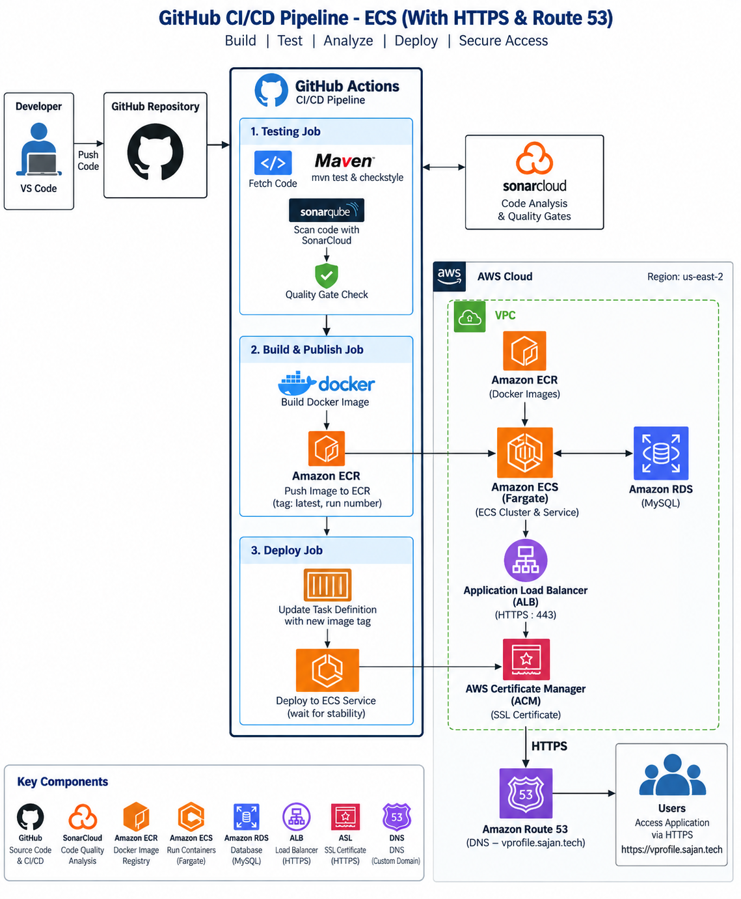
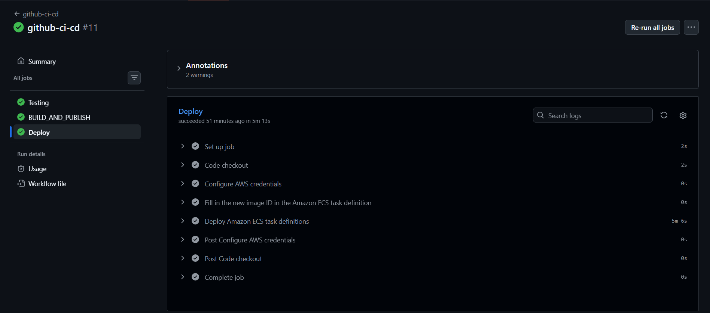
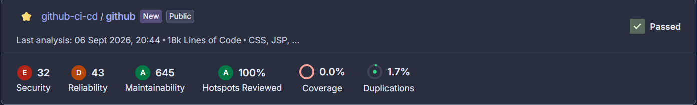
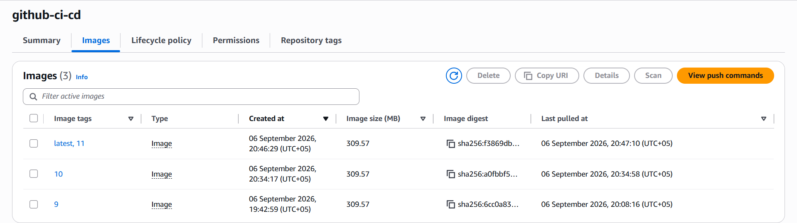
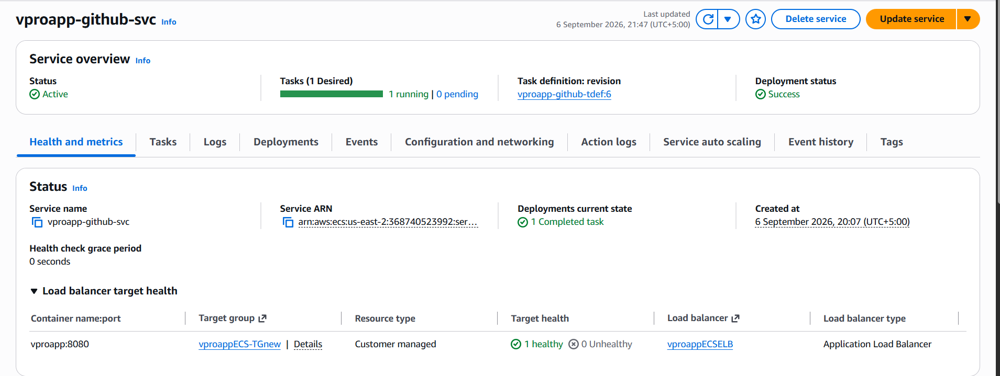
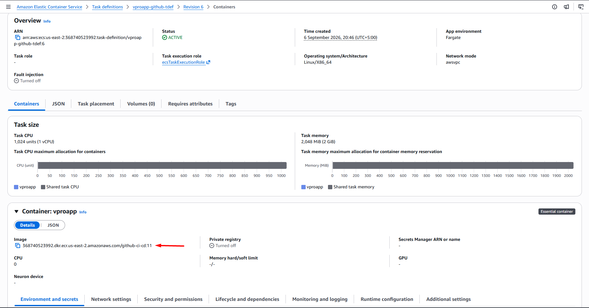
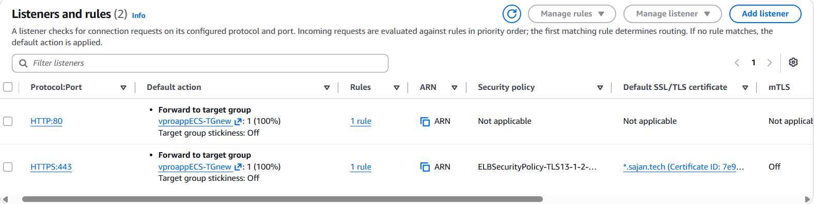
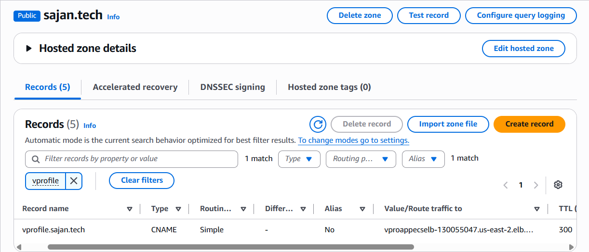
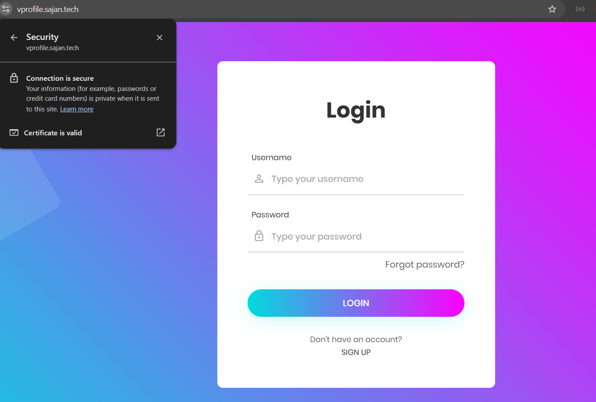

# GitHub Actions CI/CD → Amazon ECR → Amazon ECS Fargate

A production-oriented CI/CD implementation for a Java web application,
automating source validation, code quality analysis, container image
publishing, and deployment to Amazon ECS Fargate.

The AWS infrastructure is provisioned manually, while GitHub Actions
automates testing, code analysis, Docker image building and publishing
to Amazon ECR, and ECS deployment. HTTPS is provided through an
Application Load Balancer and AWS Certificate Manager, with Amazon Route
53 providing the custom domain.


## Project Overview

This project demonstrates an end-to-end delivery workflow for a
containerized Java web application:

- GitHub source control
- Maven testing and Checkstyle
- SonarCloud analysis and Quality Gate validation
- Docker image build and publishing to Amazon ECR
- ECS task-definition image update
- Amazon ECS Fargate deployment
- Application Load Balancer
- AWS Certificate Manager TLS certificate
- Amazon Route 53 custom DNS
- Secure application access over HTTPS

**Application:** `https://vprofile.sajan.tech/login`

## Architecture

```text
Developer
   |
   v
GitHub Repository
   |
   v
GitHub Actions
   |
   +--> Testing
   |      +--> Checkout
   |      +--> Maven Test
   |      +--> Checkstyle
   |      +--> SonarCloud Scan
   |      +--> Quality Gate
   |
   +--> BUILD_AND_PUBLISH
   |      +--> Inject RDS settings
   |      +--> Build Docker image
   |      +--> Push to Amazon ECR
   |
   +--> Deploy
          +--> Render ECS task definition
          +--> Apply GitHub Run Number as image tag
          +--> Deploy to ECS Fargate
          +--> Wait for service stability

Amazon ECR
   |
   v
Amazon ECS Fargate
   |
   v
Application Load Balancer
   |
   +--> HTTPS :443
          |
          +--> ACM (*.sajan.tech)
          |
          v
     ECS Target Group :8080
          |
          v
     VProfile / Tomcat

Route 53
   |
   +--> vprofile.sajan.tech
           |
           v
       ALB DNS name
```

## Key Highlights

### Automated CI/CD

GitHub Actions separates validation, image publishing, and deployment
into dependent jobs. A deployment proceeds only after the required
upstream jobs succeed.

### Quality and Security Checks

The pipeline includes Maven tests, Checkstyle, SonarCloud analysis, and
a SonarCloud Quality Gate.

### Traceable Container Releases

Images are published with:

```text
latest
<github.run_number>
```

For example, GitHub Actions run `11` produces:

```text
github-ci-cd:11
```

The same run number is used when rendering the ECS task definition,
providing a clear relationship between a CI/CD execution and its
deployed image.

### Secure Public Access

The application is exposed through:

```text
https://vprofile.sajan.tech/login
```

using Route 53, an Application Load Balancer, and an ACM wildcard
certificate for `*.sajan.tech`.

## Technology Stack

Category Technology

---

Application Java / Spring MVC / JSP
Build Maven
Runtime Tomcat 10 / JDK 21
Containerization Docker
Source Control Git / GitHub
CI/CD GitHub Actions
Code Quality Checkstyle / SonarCloud
Registry Amazon ECR
Compute Amazon ECS Fargate
Load Balancing Application Load Balancer
TLS AWS Certificate Manager
DNS Amazon Route 53
Database Amazon RDS for MySQL
AWS Region `us-east-2`

## CI/CD Pipeline

### 1. Testing

The `Testing` job:

1.  Checks out the repository.
2.  Configures Java 21.
3.  Runs Maven tests.
4.  Runs Checkstyle.
5.  Runs SonarCloud analysis.
6.  Validates the SonarCloud Quality Gate.

### 2. BUILD_AND_PUBLISH

This job depends on the testing stage:

```yaml
needs: Testing
```

It:

1.  Checks out the source.
2.  Injects the deployment database username, password, and endpoint.
3.  Builds the Docker image.
4.  Pushes the image to Amazon ECR.

### 3. Deploy

This job depends on the image publishing stage:

```yaml
needs: BUILD_AND_PUBLISH
```

The ECS task-definition renderer replaces the application container
image with:

```text
<REGISTRY>/github-ci-cd:<github.run_number>
```

The updated task definition is deployed to the ECS service, with:

```yaml
wait-for-service-stability: true
```

to wait for the service to become stable.

## AWS Environment

Resource Configuration

---

Region `us-east-2`
ECR Repository `github-ci-cd`
ECS Cluster `vproapp-github`
ECS Service `vproapp-github-svc`
Task Definition Family `vproapp-github-tdef`
Container `vproapp`
Container Port `8080`
Target Group `vproappECS-TGnew`
Load Balancer `vproappECSELB`
Application Domain `vprofile.sajan.tech`
ACM Certificate `*.sajan.tech`
HTTPS Listener `443`

## Docker Implementation

The Dockerfile uses a multi-stage build:

```text
Maven + JDK 21
      |
      v
Build WAR
      |
      v
Tomcat 10 + JDK 21
      |
      v
ROOT.war
      |
      v
Port 8080
```

Runtime command:

```dockerfile
CMD ["catalina.sh", "run"]
```

## Database Configuration

The default configuration is stored in:

```text
src/main/resources/application.properties
```

Before the image is built, the workflow replaces:

```text
jdbc.username
jdbc.password
jdbc.url
```

The database hostname replacement targets the original development
hostname:

```bash
sed -i "s/vprodb/${{ secrets.RDS_ENDPOINT }}/" src/main/resources/application.properties
```

Deployment credentials are therefore not committed to the repository.

## HTTPS, ACM & Route 53

### Route 53

A CNAME record maps:

```text
vprofile.sajan.tech
```

to the Application Load Balancer DNS name.

### ACM

The HTTPS listener uses:

```text
*.sajan.tech
```

which covers the `vprofile.sajan.tech` hostname.

### Application Load Balancer

```text
HTTPS :443
     |
     +--> ACM (*.sajan.tech)
     |
     +--> vproappECS-TGnew
     |
     +--> ECS container :8080
```

HTTP `:80` is also configured. For a production environment, HTTP should
redirect to HTTPS so that the secure endpoint is consistently enforced.

## GitHub Repository Secrets

The workflow expects these repository secrets:

```text
SONAR_TOKEN
SONAR_URL
SONAR_ORGANIZATION
SONAR_PROJECT_KEY

AWS_ACCESS_KEY_ID
AWS_SECRET_ACCESS_KEY
REGISTRY

RDS_USER
RDS_PASS
RDS_ENDPOINT
```

`REGISTRY` contains the ECR registry URI without the repository name:

```text
368740523992.dkr.ecr.us-east-2.amazonaws.com
```

The workflow constructs:

```text
<REGISTRY>/<ECR_REPOSITORY>:<github.run_number>
```

## Workflow Configuration

Workflow file:

```text
.github/workflows/main.yml
```

Current trigger:

```yaml
on: workflow_dispatch
```

This allows a deployment to be started manually from GitHub Actions. A
push-based trigger can be introduced when automatic deployment on source
changes is required.

## Project Evidence

The `screenshots/` directory contains the implementation evidence for the CI/CD pipeline, AWS infrastructure, HTTPS configuration, DNS setup, and final application deployment.

### Architecture



### GitHub Actions



### SonarCloud Quality Gate



### Amazon ECR



### Amazon ECS Service



### ECS Task Definition



### Application Load Balancer — HTTPS



### Route 53 DNS



### VProfile Application — HTTPS Login



## Project Structure

```text
github-cicd-ecs/
├── .github/
│   └── workflows/
│       └── main.yml
├── aws-files/
│   └── taskdeffile.json
├── src/
│   └── main/
│       ├── java/
│       ├── resources/
│       └── webapp/
├── screenshots/
│   ├── 01-architecture.png
│   ├── 02-github-actions.png
│   ├── 03-sonar-quality-gate.png
│   ├── 04-ecr-images.png
│   ├── 05-ecs-service.png
│   ├── 06-ecs-task-definition.png
│   ├── 07-alb-https-listener.png
│   ├── 08-route53-dns.png
│   └── 09-https-login.png
├── Dockerfile
├── pom.xml
└── README.md
```

## Security & Operational Considerations

- Credentials are supplied through GitHub repository secrets rather
  than committed to source control.
- TLS is terminated at the Application Load Balancer using ACM.
- ECS Fargate provides the container runtime without requiring server
  management.
- Numbered ECR image tags provide release traceability.
- ECS deployment waits for service stability before the workflow
  completes.
- The application is accessed through a custom DNS hostname rather
  than directly exposing the ECS task.

For further production hardening, the architecture can be extended with
least-privilege IAM policies, centralized secret management,
HTTP-to-HTTPS redirection, monitoring, logging, and alerting.

## Project Outcome

The implementation connects the complete application delivery lifecycle:

```text
Source Code
    ↓
Automated Testing
    ↓
Code Quality Analysis
    ↓
Docker Image
    ↓
Amazon ECR
    ↓
Amazon ECS Fargate
    ↓
Application Load Balancer
    ↓
ACM / HTTPS
    ↓
Route 53
    ↓
Secure VProfile Application
```

The result is a repeatable CI/CD workflow that takes a Java application
from source code through automated validation and container publishing
to an ECS Fargate deployment, with secure public access through a custom
HTTPS domain.
