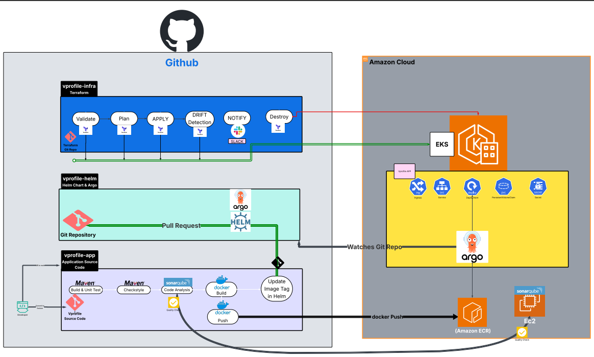
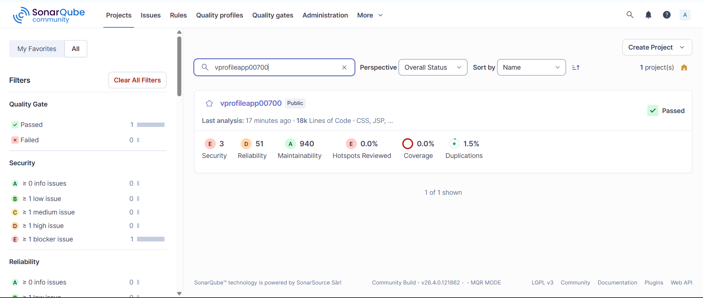
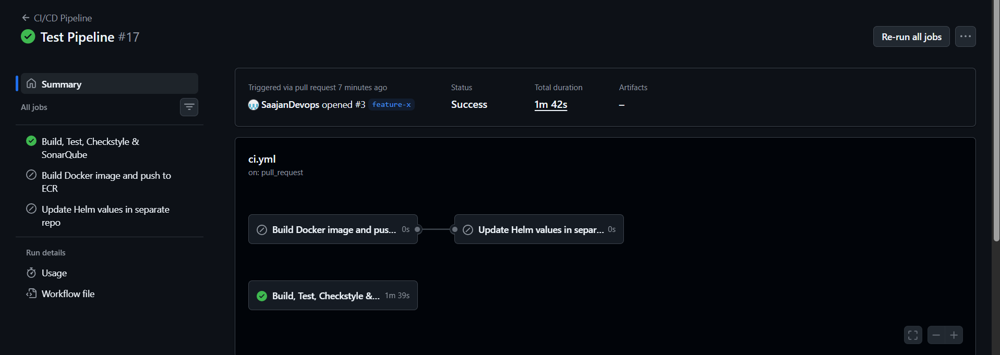
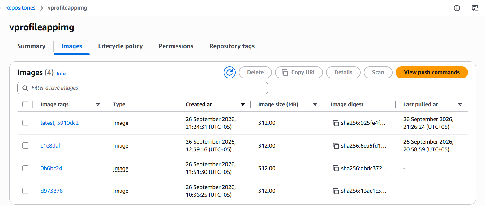
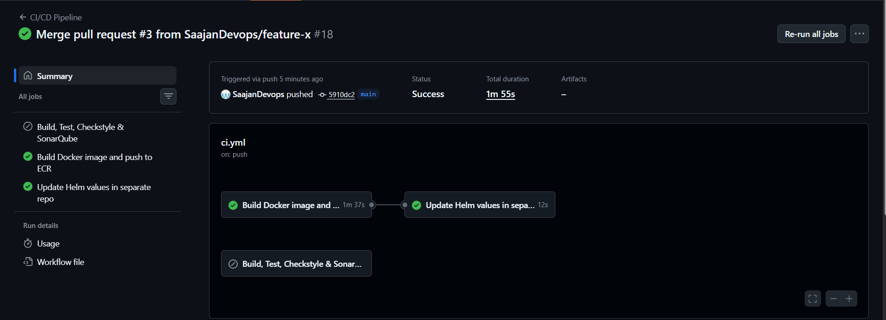
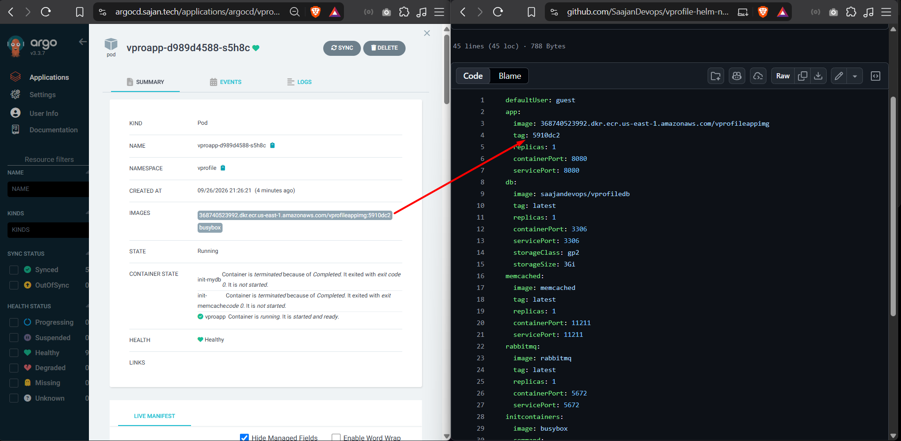
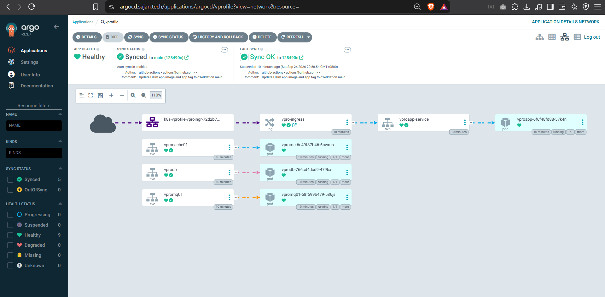
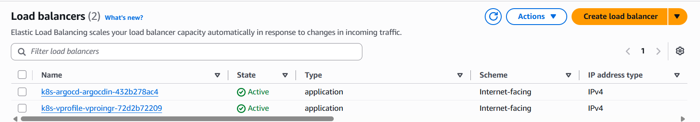
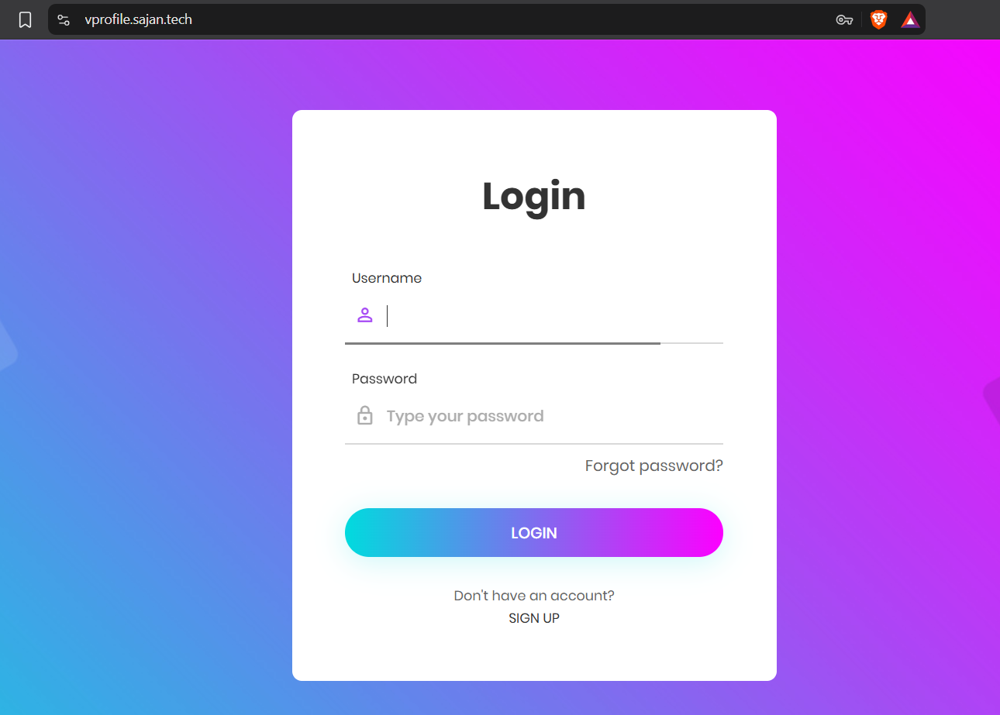

# 🚀 VProfile — GitOps Delivery Platform on AWS EKS

> **An end-to-end DevOps and GitOps implementation for building, testing, containerizing, and continuously deploying the VProfile application to Amazon EKS.**

<p align="center">
  
  
  
  
  
  
  
  
</p>

---

## 🎯 What This Project Is

This repository combines three focused components into one complete delivery platform:

| Component | Responsibility |
|---|---|
| [`vprofile-app`](./vprofile-app) | Java application, tests, Docker build and GitHub Actions CI |
| [`vprofile-helm`](./vprofile-helm) | Helm chart, Kubernetes desired state and Argo CD configuration |
| [`vprofile-infra`](./vprofile-infra) | AWS infrastructure and EKS provisioning with Terraform |

The platform demonstrates a practical delivery chain:

**Pull Request → Build & Test → Checkstyle → SonarQube → Quality Gate**

and, after changes reach `main`:

**Build VProfile Image → Amazon ECR → Update Helm Repository → Argo CD → Amazon EKS → AWS Load Balancer → Application**

---

# 🏗️ Architecture



### Platform Flow

```text
                         ┌─────────────────────┐
                         │      Developer      │
                         │     Source Code     │
                         └──────────┬──────────┘
                                    │
                                    ▼
                         ┌─────────────────────┐
                         │       GitHub        │
                         │   vprofile-app      │
                         └──────────┬──────────┘
                                    │
                    ┌───────────────┴────────────────┐
                    │                                │
              Pull Request                      Push to main
                    │                                │
                    ▼                                ▼
          ┌──────────────────┐             ┌──────────────────┐
          │  GitHub Actions  │             │  GitHub Actions  │
          │ Build + Test     │             │ Docker Build     │
          │ Checkstyle       │             │ VProfile App     │
          │ SonarQube        │             └────────┬─────────┘
          │ Quality Gate     │                      │
          └──────────────────┘                      ▼
                                             ┌────────────────┐
                                             │   Amazon ECR   │
                                             │ VProfile Image │
                                             └───────┬────────┘
                                                     │
                                                     ▼
                                      ┌─────────────────────────┐
                                      │    vprofile-helm        │
                                      │                         │
                                      │ values.yaml image/tag   │
                                      └────────────┬────────────┘
                                                   │
                                                   │ Git push
                                                   ▼
                                             ┌────────────┐
                                             │  Argo CD   │
                                             │   GitOps   │
                                             └─────┬──────┘
                                                   │
                                                   ▼
                                             ┌────────────┐
                                             │   AWS EKS  │
                                             │ Kubernetes │
                                             └─────┬──────┘
                                                   │
                                                   ▼
                                         ┌──────────────────┐
                                         │ AWS Load Balancer│
                                         │ / Kubernetes     │
                                         │ Ingress          │
                                         └────────┬─────────┘
                                                  │
                                                  ▼
                                           🌐 VProfile App
```

### Runtime Application Components

The CI pipeline **builds and publishes the VProfile application image**. The supporting services are deployed from their configured container images through the Helm deployment.

```text
                         AWS EKS
                            │
              ┌─────────────┼─────────────┐
              │             │             │
              ▼             ▼             ▼
        VProfile App      Database     RabbitMQ
        (ECR image)    (configured     (configured
                       container)      container)
                            │
                            └──────┬──────┘
                                   ▼
                              Memcached
                            (configured
                             container)

                    + application dependencies
                       defined by the chart
```

The exact image sources, tags, replicas, services, and configuration are maintained in:

```text
vprofile-helm/helm/vprofile/values.yaml
```

---

# 🔄 CI/CD Pipeline

The application workflow is:

```text
vprofile-app/.github/workflows/ci.yml
```

The workflow uses **two event-driven paths**.

## 1. Pull Request → Build, Test & Quality Validation

When a pull request targets `main`:

```text
Pull Request
     │
     ▼
Checkout
     │
     ▼
JDK 21
     │
     ▼
Maven Build + Unit Tests
     │
     ▼
Checkstyle
     │
     ▼
SonarQube Analysis
     │
     ▼
SonarQube Quality Gate
```

The workflow:

- Checks out the repository with full history.
- Sets up JDK 21.
- Caches Maven dependencies.
- Caches the Sonar scanner cache.
- Runs `mvn clean verify checkstyle:checkstyle -B`.
- Runs the SonarQube scan.
- Waits for the SonarQube quality-gate result.

Evidence:





---

## 2. Push to `main` → Build & Publish VProfile Image

When changes are pushed to `main`, the delivery path builds **the VProfile application image**:

```text
Push to main
     │
     ▼
Checkout
     │
     ▼
Configure AWS Credentials
     │
     ▼
Create ECR Repository if Needed
     │
     ▼
Build VProfile Docker Image
     │
     ▼
Tag with 7-character Git SHA
     │
     ├──────────────► :<commit-sha>
     │
     └──────────────► :latest
     │
     ▼
Push to Amazon ECR
```

The application image is built from:

```text
Docker-files/app/multistage/Dockerfile
```

The pipeline does **not** build separate Docker images for the database, RabbitMQ, or Memcached as part of this job. Those supporting services use their configured container images through the Kubernetes/Helm deployment.

Evidence:



---

# 🔁 GitOps Deployment Flow

After the VProfile image is successfully pushed to ECR, the workflow updates the separate Helm repository.

```text
VProfile image pushed to ECR
             │
             ▼
       Clone vprofile-helm
             │
             ▼
        Install yq
             │
             ▼
       Update values.yaml
             │
             ├── app.image
             └── app.tag
             │
             ▼
       Commit Helm change
             │
             ▼
       Push to Helm repo
             │
             ▼
          Argo CD
             │
             ▼
       Synchronize to EKS
```

The workflow updates:

```yaml
app:
  image: <ECR image>
  tag: <7-character Git SHA>
```

in:

```text
vprofile-helm/helm/vprofile/values.yaml
```

This creates a clear separation:

```text
Application Repository
        │
        │ build
        ▼
     Amazon ECR
        │
        │ image reference
        ▼
Helm / GitOps Repository
        │
        │ desired state
        ▼
     Argo CD
        │
        ▼
      AWS EKS
```

Evidence:





---

# ☸️ Kubernetes & Helm

The Kubernetes delivery configuration lives in:

```text
vprofile-helm/
```

The main Helm chart is:

```text
vprofile-helm/helm/vprofile/
```

It contains templates for the application stack, including:

- Application Deployment
- Database Deployment
- RabbitMQ Deployment
- Memcached Deployment
- Services
- PersistentVolumeClaim
- Secrets
- Ingress
- Docker registry authentication

The repository also retains Kubernetes definitions under:

```text
vprofile-helm/kubedefs/
```

This makes the repository useful both as a record of the Kubernetes resources and as the Helm-based desired-state source used for GitOps delivery.

---

# 🔁 Argo CD

Argo CD provides the GitOps deployment layer.

```text
Git
 │
 │ desired Kubernetes state
 ▼
Argo CD
 │
 │ sync
 ▼
Amazon EKS
 │
 ▼
VProfile workloads
```

Argo CD-related configuration is maintained under:

```text
vprofile-helm/argocd/
vprofile-helm/apps/
vprofile-helm/projects/
```

Argo CD watches the configured Git source and applies the desired state to the Kubernetes cluster.



---

# 🏗️ AWS Infrastructure with Terraform

The AWS infrastructure is maintained in:

```text
vprofile-infra/
```

Terraform configuration includes:

```text
vprofile-infra/
├── main.tf
├── variables.tf
├── outputs.tf
├── backend.tf
└── iam_policy.json
```

The repository also contains:

```text
argocd-ingress.yaml
```

for supporting Kubernetes/Argo CD ingress configuration.

The infrastructure layer provides the AWS/EKS foundation on which the GitOps deployment runs.

➡️ [`vprofile-infra`](./vprofile-infra)

---

# 🌐 Ingress & Application Access

The application is exposed through Kubernetes Ingress and the AWS Load Balancer integration.

```text
Internet
   │
   ▼
AWS Load Balancer
   │
   ▼
Kubernetes Ingress
   │
   ▼
VProfile Service
   │
   ▼
VProfile Pod
```

Evidence:



Final application verification:



---

# 🔐 SonarQube Server Setup

The project includes:

```text
resources/scripts/sonar-setup.sh
```

This is a reusable setup script for installing and configuring the SonarQube server on an Ubuntu EC2 instance used by the CI quality-analysis workflow.

The script handles the server-side setup required for the SonarQube environment, including Java, PostgreSQL, SonarQube configuration, systemd service configuration, and Nginx reverse proxy configuration.

It is intentionally kept as an implementation artifact so the CI quality-analysis environment is reproducible.

---

# 🤖 AI-Assisted Implementation Prompts

The project also contains a reusable prompt library:

```text
resources/prompts/
```

These prompts document how AI assistance was used during implementation to generate or transform specific infrastructure and GitOps components.

| Prompt | Purpose |
|---|---|
| `01-terraform-eks.md` | Generate Terraform configuration for AWS/EKS infrastructure |
| `02-ebs-csi-driver.md` | Configure the AWS EBS CSI Driver for Kubernetes storage |
| `03-helm-chart.md` | Transform Kubernetes definitions into a reusable Helm chart |
| `04-argocd-and-ingress.md` | Generate Argo CD and Ingress configuration |
| `05-argocd-vprofile-app.md` | Generate the Argo CD application configuration for VProfile |

### AI-Assisted Workflow

```text
Requirements / Existing Configuration
                │
                ▼
        AI Implementation Prompt
                │
                ▼
       Generated Configuration
                │
                ▼
          Review & Modify
                │
                ▼
          Validate / Test
                │
                ▼
             Deploy
```

The prompts are provided as **reproducible implementation references**. Generated output was reviewed, modified where necessary, validated, and integrated into the project.

---

# 📂 Repository Structure

```text
GitOps-Argo/
│
├── README.md
├── SECURITY.md
│
├── resources/
│   ├── commands/
│   │   ├── 01-install-tools.md
│   │   ├── 02-terraform-bootstrap.md
│   │   ├── 03-aws-eks-and-kubeconfig.md
│   │   ├── 04-alb-cert-manager.md
│   │   ├── 05-argocd.md
│   │   └── 06-vprofile-verification.md
│   │
│   ├── prompts/
│   │   ├── 01-terraform-eks.md
│   │   ├── 02-ebs-csi-driver.md
│   │   ├── 03-helm-chart.md
│   │   ├── 04-argocd-and-ingress.md
│   │   └── 05-argocd-vprofile-app.md
│   │
│   ├── screenshots/
│   ├── scripts/
│   │   └── sonar-setup.sh
│   └── variables/
│       └── github-variables-and-secrets.example.md
│
├── vprofile-app/
│   ├── .github/workflows/
│   │   └── ci.yml
│   ├── Docker-files/
│   ├── src/
│   ├── pom.xml
│   └── sonar-project.properties
│
├── vprofile-helm/
│   ├── apps/
│   ├── argocd/
│   ├── helm/
│   │   └── vprofile/
│   ├── kubedefs/
│   └── projects/
│
└── vprofile-infra/
    ├── main.tf
    ├── variables.tf
    ├── outputs.tf
    ├── backend.tf
    ├── iam_policy.json
    └── argocd-ingress.yaml
```

---

# 🧭 Where to Start

If you are reviewing this project for the first time, follow this path:

### 01 — Understand the architecture

Start with:

```text
resources/screenshots/01-architecture.png
```

Then read this README.

### 02 — Review the application CI workflow

Open:

```text
vprofile-app/.github/workflows/ci.yml
```

Pay particular attention to:

- Pull request quality checks
- Maven build and tests
- Checkstyle
- SonarQube
- Docker image build
- Amazon ECR publishing
- Helm repository update

### 03 — Review the infrastructure

Open:

```text
vprofile-infra/
```

Start with:

```text
main.tf
variables.tf
outputs.tf
```

### 04 — Review Kubernetes and Helm

Open:

```text
vprofile-helm/
```

Start with:

```text
helm/vprofile/values.yaml
helm/vprofile/templates/
```

Then inspect:

```text
kubedefs/
argocd/
apps/
projects/
```

### 05 — Follow the GitOps path

Trace the image reference from:

```text
GitHub Actions
      ↓
Amazon ECR
      ↓
vprofile-helm/values.yaml
      ↓
Argo CD
      ↓
EKS
```

### 06 — Review deployment evidence

Open:

```text
resources/screenshots/
```

The screenshots provide visual evidence of the major implementation stages.

---

# 🧰 Resources

## Commands

```text
resources/commands/
```

Sequential command references covering:

1. Tool installation
2. Terraform bootstrap
3. AWS EKS and kubeconfig
4. ALB and certificate configuration
5. Argo CD setup
6. VProfile verification

## Prompts

```text
resources/prompts/
```

Reusable AI-assisted implementation prompts for the infrastructure and GitOps components.

## Screenshots

```text
resources/screenshots/
```

Implementation and deployment evidence.

## Scripts

```text
resources/scripts/
```

Reusable automation scripts, including the SonarQube EC2 setup script.

## Variables

```text
resources/variables/
```

Reference configuration for GitHub Actions variables and secrets.

---

# 🧪 Verification

The following checks can be used to verify the deployed environment.

### Terraform

```bash
terraform plan
terraform apply
```

### Kubernetes

```bash
kubectl get nodes
kubectl get pods -A
kubectl get svc -A
kubectl get ingress -A
```

### Helm

```bash
helm lint ./vprofile-helm/helm/vprofile
```

### Argo CD

Verify that:

- The VProfile application exists.
- The Git repository is connected.
- The application is synchronized.
- The application health is healthy.
- The expected Kubernetes resources are running.

### Application

Open the configured application endpoint through the Load Balancer/Ingress and verify the VProfile application.

---

# 📸 Deployment Evidence

| # | Evidence |
|---:|---|
| 01 | Architecture |
| 02 | EKS cluster |
| 03 | SonarQube quality gate |
| 04 | Build and test |
| 05 | Amazon ECR images |
| 06 | ECR image + Helm update |
| 07 | Argo CD dashboard |
| 08 | Image tag update |
| 09 | AWS Load Balancer |
| 10 | VProfile application |

All screenshots are stored in:

```text
resources/screenshots/
```

---

# 🎯 What This Project Demonstrates

This project demonstrates practical implementation of:

- Infrastructure as Code with Terraform
- Amazon EKS
- AWS networking and IAM
- Docker containerization
- Amazon ECR
- GitHub Actions
- Maven builds and automated tests
- Checkstyle
- SonarQube analysis
- SonarQube quality gates
- Kubernetes
- Helm
- Kubernetes Services
- Ingress
- Persistent storage
- Kubernetes Secrets
- Argo CD
- GitOps
- Multi-tier application deployment
- CI-driven container delivery
- Git-based Kubernetes desired state
- Operational verification and troubleshooting

---

# 🔐 Security

Security guidance is available in:

➡️ [`SECURITY.md`](./SECURITY.md)

For production use:

- Replace demonstration credentials.
- Store sensitive values in an appropriate secret-management system.
- Apply least-privilege IAM policies.
- Restrict AWS Security Group access.
- Configure HTTPS/TLS appropriately.
- Never commit credentials, access keys, tokens, or private keys.
- Rotate credentials when required.

---

# 🧩 Separation of Responsibilities

The project intentionally separates application, deployment, and infrastructure responsibilities.

```text
┌──────────────────────────────────┐
│          vprofile-app            │
│                                  │
│ Java + Maven + Tests + CI        │
│ Docker Build + ECR Publishing    │
└────────────────┬─────────────────┘
                 │
                 │ Image
                 ▼
          ┌──────────────┐
          │  Amazon ECR  │
          └──────┬───────┘
                 │
                 │ Image reference
                 ▼
┌──────────────────────────────────┐
│         vprofile-helm            │
│                                  │
│ Helm + Kubernetes + Argo CD      │
│ Git-based Desired State          │
└────────────────┬─────────────────┘
                 │
                 │ Sync
                 ▼
            ┌───────────┐
            │  Argo CD  │
            └─────┬─────┘
                  │
                  ▼
            ┌───────────┐
            │  AWS EKS  │
            └───────────┘

┌──────────────────────────────────┐
│         vprofile-infra           │
│                                  │
│ Terraform + AWS Infrastructure   │
└──────────────────────────────────┘
```

This separation makes the platform easier to understand, maintain, and evolve.

---

# ⭐ End-to-End Summary

```text
┌──────────────┐
│    GitHub    │
│ vprofile-app │
└──────┬───────┘
       │
       ├── Pull Request ──► Build + Test + Checkstyle
       │                         │
       │                         ▼
       │                    SonarQube
       │                         │
       │                         ▼
       │                    Quality Gate
       │
       └── Push to main ──► Docker Build
                                  │
                                  ▼
                              Amazon ECR
                                  │
                                  ▼
                         Update Helm values
                                  │
                                  ▼
                            Git push
                                  │
                                  ▼
                              Argo CD
                                  │
                                  ▼
                             AWS EKS
                                  │
                                  ▼
                         AWS Load Balancer
                                  │
                                  ▼
                            VProfile App
```

### Core Delivery Model

**Application CI → Container Registry → Git-based Desired State → Argo CD → Kubernetes**

---

## 📚 Quick Navigation

| Resource | Purpose |
|---|---|
| [`vprofile-app`](./vprofile-app) | Application, tests, Docker and CI |
| [`vprofile-helm`](./vprofile-helm) | Helm, Kubernetes and Argo CD |
| [`vprofile-infra`](./vprofile-infra) | Terraform and AWS infrastructure |
| [`resources/commands`](./resources/commands) | Step-by-step command references |
| [`resources/prompts`](./resources/prompts) | AI-assisted implementation prompts |
| [`resources/screenshots`](./resources/screenshots) | Deployment evidence |
| [`resources/scripts`](./resources/scripts) | Automation scripts |
| [`resources/variables`](./resources/variables) | GitHub configuration reference |
| [`SECURITY.md`](./SECURITY.md) | Security guidance |

---

> **Infrastructure as Code → Continuous Integration → Container Registry → GitOps → Kubernetes → Application Delivery**
