# Jenkins CI/CD to ECS Pipeline

An end-to-end Jenkins pipeline for the VProfile Java web application,
split across two pipelines: **Stage** (build, test, code quality gate,
Docker build, deploy to staging ECS) and **Prod** (deploy-only promotion
to production).

## Scope

This pipeline builds and deploys **only the Tomcat/app container** to ECS.
The full VProfile stack also includes MySQL, RabbitMQ, and Memcached
(Dockerfiles for these are included in `Docker-files/db/` and
`Docker-files/web/` for reference) — those backend services are **not**
provisioned as part of this ECS deployment.

This is a deliberate scope decision, not an oversight: the goal of this
project is to demonstrate the CI/CD pipeline mechanics (build → test →
scan → publish → containerize → deploy → promote), not to stand up the
full multi-tier application on ECS. As a result:

- ECS "Deployment failure detection" is deliberately unchecked, since the app logs a RabbitMQ connection error on startup (expected, and safe to ignore in this context)
- The app container serves HTTP traffic and the base UI, but features depending on MySQL/RabbitMQ/Memcached will not function against this ECS deployment
- A full backend stack (Tomcat, MySQL, Memcached, RabbitMQ) is deployed separately via Ansible in `01-infrastructure-as-code/ansible-full-stack-deployment` — pairing that approach with this pipeline would be the natural next step if extending this project to a complete ECS deployment

## Pipeline Flow

```
Push to jenkins-cicd branch
        │
        ▼
   Build (Maven)
        │
        ▼
   Unit Test
        │
        ▼
   Checkstyle Analysis
        │
        ▼
   Sonar Code Analysis ──► SonarQube dashboard
        │
        ▼
   Quality Gate (abort pipeline if failed)
        │
        ▼
   Publish to Nexus (versioned by BUILD_ID + timestamp)
        │
        ▼
   Build Docker Image (multi-stage: Maven build → Tomcat runtime)
        │
        ▼
   Push to ECR (tags: $BUILD_NUMBER + latest)
        │
        ▼
   Deploy to Staging ECS (force-new-deployment)
        │
        ▼
   Slack Notification (always — success or failure)
        │
        ▼
   [Manual gate: PR + merge jenkins-cicd → prod]
        │
        ▼
   Deploy to Production ECS (same tested image, no rebuild/retest)
```

## Stack

Jenkins, Git/GitHub (SSH), Maven, Nexus, SonarQube, Slack, Docker,
AWS ECR, AWS ECS (Fargate), AWS IAM, Application Load Balancer,
MySQL, Nginx, Tomcat

## Structure

- `StagePipeline/Jenkinsfile` — full CI + CD pipeline, deploys to staging ECS
- `ProdPipeline/Jenkinsfile` — minimal deploy-only pipeline for production
- `settings.xml` — Maven config pointing dependency resolution through Nexus
- `pom.xml` — Maven build configuration
- `src/` — VProfile reference application source
- `Docker-files/app/Dockerfile` — single-stage app image (Tomcat + built .war)
- `Docker-files/app/multistage/Dockerfile` — multi-stage build used by the pipeline (Maven build stage → Tomcat runtime stage)
- `Docker-files/db/Dockerfile` — MySQL image seeded with the app's schema
- `Docker-files/web/Dockerfile` — Nginx reverse proxy image
- `userdata/` — EC2 user-data scripts that provision Jenkins, Nexus, and SonarQube automatically
- `docs/infrastructure-setup.md` — full infra reference: security groups, IAM, Nexus repos, Jenkins tools/plugins/credentials, ECS config, and real gotchas hit during setup
- `screenshots/` — pipeline run evidence

## Branch Strategy

```
jenkins-cicd  → build, test, code quality, Docker build, deploy to staging ECS
   └── prod     → deploy-only, promotes the already-tested image to production
```

Promotion to production is a deliberate **manual gate** — everything up to
staging is fully automated (triggered by a GitHub webhook on push);
going to prod requires opening a PR from `jenkins-cicd` into `prod` and
merging it.

## Jenkins Plugins Used

Maven Integration, GitHub Integration, Nexus Artifact Uploader,
SonarQube Scanner, Slack Notification, Build Timestamp, Docker Pipeline,
CloudBees Docker Build and Publish, Amazon ECR, Pipeline: AWS Steps

## Key Configuration

- GitHub webhook triggers Jenkins automatically on push to `jenkins-cicd` (`/github-webhook/`)
- SonarQube quality gate blocks the pipeline on failure; SonarQube notifies Jenkins back via its own webhook (`/sonarqube-webhook/`, private IP)
- Nexus (`vpro-maven-group`) used as the single Maven dependency mirror; built artifacts published to `vprofile-release`, versioned by build ID + timestamp
- Slack notified on every run (success = green, failure = red) with a direct link to the build log
- Docker image built via a multi-stage Dockerfile, tagged with both the build number and `latest`, pushed to ECR
- ECS staging (`vproappstaging`) and production (`vproappProd`) are **separate clusters/services** sharing the same task definition family — production only ever runs an image already validated in staging

Full details (security groups, IAM, Nexus repos, ECS task/service config)
are in [`docs/infrastructure-setup.md`](docs/infrastructure-setup.md).

## How to Run

1. Provision the three servers (Jenkins, Nexus, SonarQube) — see `userdata/` and `docs/infrastructure-setup.md`
2. Configure Jenkins tools (JDK17, MAVEN3.9, sonarscanner) and credentials (`nexuslogin`, `sonartoken`, `slacktoken`, `awscreds`)
3. Create the ECS staging cluster/service and production cluster/service
4. Push to the `jenkins-cicd` branch — the webhook triggers the staging pipeline automatically
5. Validate the change on the staging load balancer URL
6. Open a PR from `jenkins-cicd` into `prod` and merge — this triggers the production pipeline

## What I changed from the course version

- Moved the Nexus password out of the Jenkinsfile and into a Jenkins credential (`credentials('nexuslogin')`) instead of hardcoding it in plaintext
- [Add anything else you changed — e.g. adjusted the SonarQube quality gate threshold, changed instance sizing, added a health check, etc.]

## Screenshots

### CI Pipeline (jenkins-ci) — Build, Test, Quality Gate

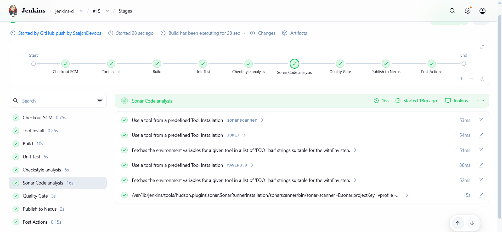

### Staging CI/CD Pipeline (vprofile-cicd) — Build through ECS Deploy

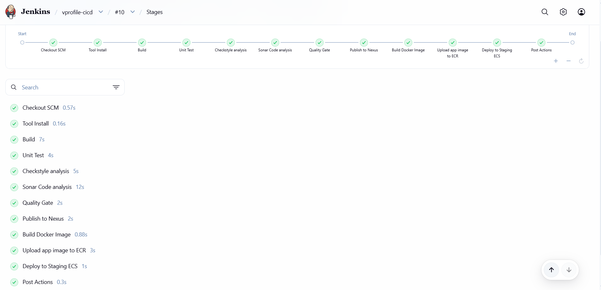

### GitHub Webhook — Automatic Trigger

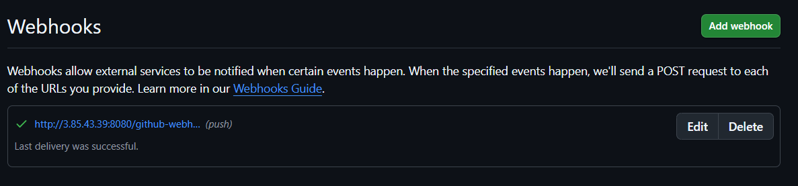

### SonarQube Quality Gate

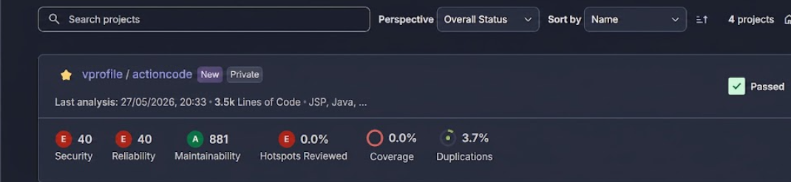

### Artifact Published to Nexus

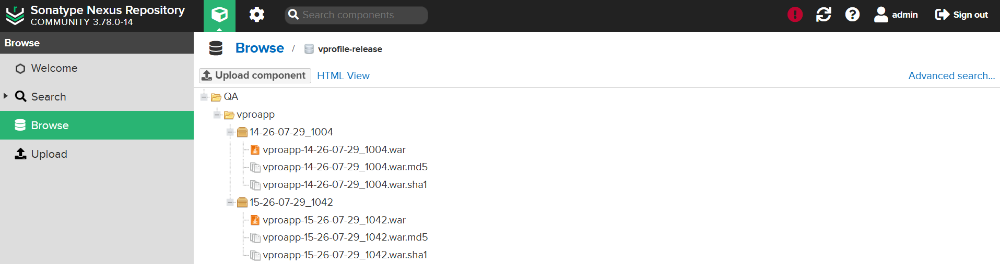

### Slack Notification

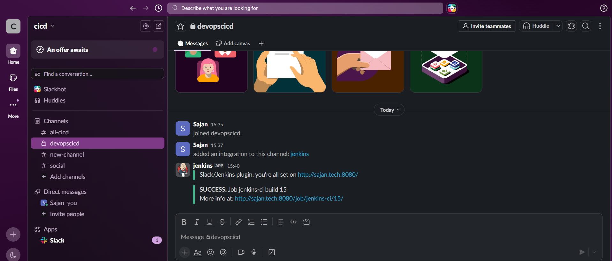

### Docker Image Pushed to ECR

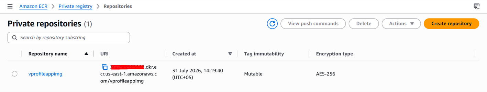

### ECS Clusters (Staging + Production)

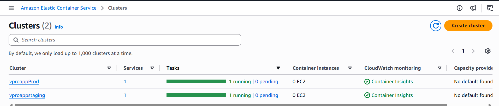

### ECS Production Service Running


### ECS Task Definition

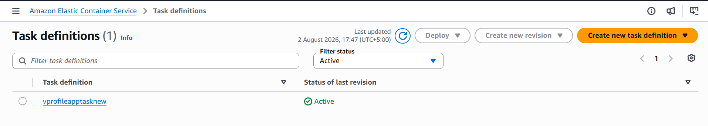

### All Jenkins Pipeline Jobs

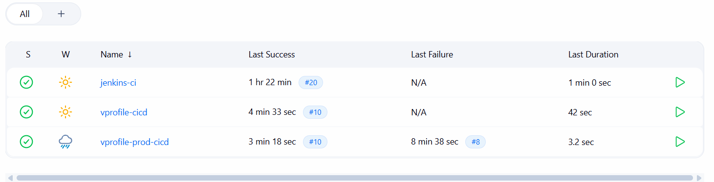

### Load Balancers (Staging + Production)

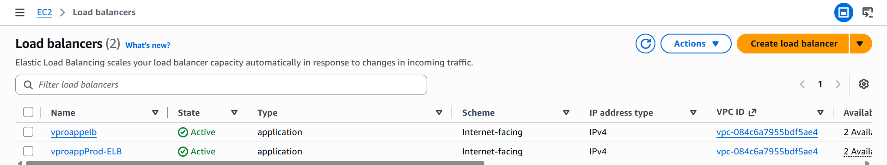

### App Live in Browser

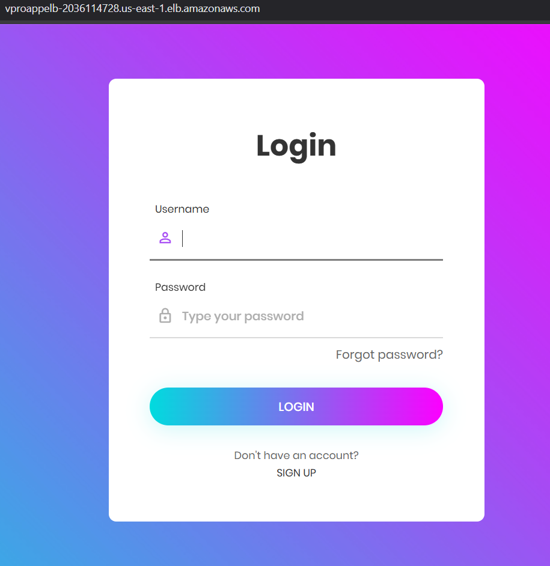

---

_Account IDs and internal ARNs are cropped from all screenshots above._
