# Lift and Shift: VProfile on AWS EC2

Migrates the VProfile multi-tier Java application from a local Vagrant
setup to AWS, using a **lift and shift (rehost)** strategy — the same
service architecture (Tomcat, MySQL, Memcached, RabbitMQ) moved onto EC2
instances, without changing the design to use managed AWS services yet.

## Why Lift and Shift

Lift and shift is usually a first step, not a final architecture: get the
workload off local/on-prem infrastructure and onto the cloud with minimal
changes, so it's running on pay-as-you-go infrastructure with elastic
scaling — then re-architect onto managed services afterward. This project
demonstrates that first step specifically; a follow-up project
re-architects the same app onto Elastic Beanstalk, RDS, and ElastiCache.

## Architecture

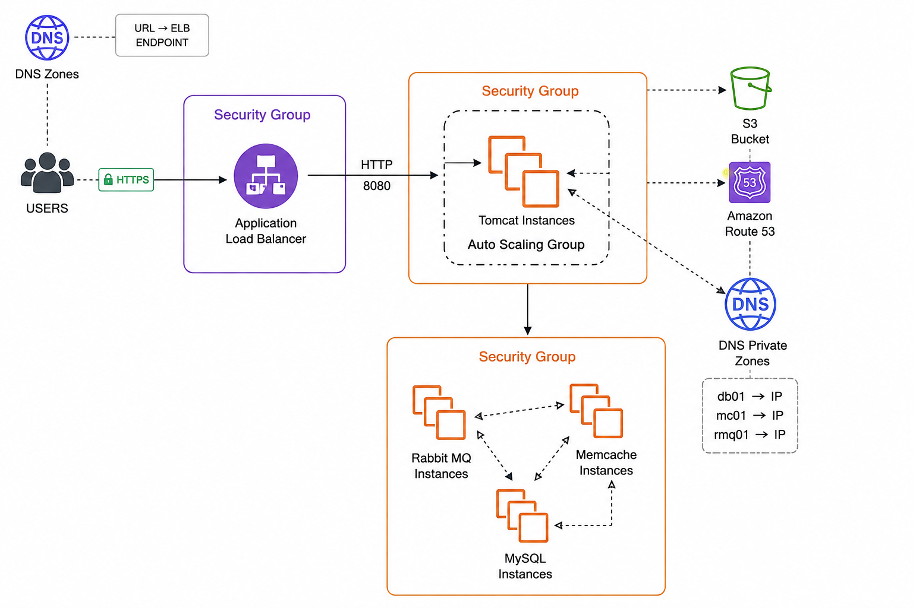

Users hit the app over HTTPS through Route 53 / the domain registrar,
which points at the Application Load Balancer's endpoint. The ALB
(behind its own security group) forwards HTTP on port 8080 to the Tomcat
Auto Scaling Group. Tomcat instances then reach the three backend
services — RabbitMQ, Memcached, and MySQL — over a separate backend
security group, resolving each by name via a Route 53 private hosted
zone (`db01`/`mc01`/`rmq01` → private IP) rather than hardcoded IPs.

## Stack

AWS EC2, Application Load Balancer, Auto Scaling Groups, Route 53
(private hosted zone), ACM, S3, IAM, Amazon Linux 2023, Ubuntu 24.04,
MariaDB, Memcached, RabbitMQ, Apache Tomcat 10, Maven

## Structure

- `userdata/` — EC2 user-data scripts that provision each service unattended (`mysql.sh`, `memcache.sh`, `rabbitmq.sh`, `tomcat_ubuntu.sh`)
- `src-config/application.properties.example` — sanitized template showing how the app is wired to the backend services via private DNS names
- `docs/infrastructure-setup.md` — full reference: security groups, IAM, build/deploy flow, load balancer/ASG config, and real gotchas hit during setup
- `screenshots/` — deployment evidence

## Key Configuration

- **4 EC2 instances**, each provisioned via user data (no manual install): MySQL/Memcached/RabbitMQ on Amazon Linux 2023, Tomcat on Ubuntu 24.04
- **3 security groups**, each tier only reachable from the tier in front of it (internet → ELB → app → backend)
- **Private Route 53 hosted zone** resolves `db01`/`mc01`/`rmq01.<yourdomain>.tech` to private IPs, so the app never references raw IPs
- **Build happens locally**: `mvn install` → push `.war` to S3 → pull from S3 on the Tomcat instance → deploy
- **IAM role attached directly to the app instance** (not stored credentials) for the S3 pull, with a separate IAM user for the local push
- **HTTPS via ACM certificate** on the load balancer, backed by a CNAME record at the domain registrar
- **Target group stickiness enabled** — this app has no shared session state across instances, so users must consistently hit the same backend
- **Auto Scaling Group** (min 1 / max 4) with CPU-based target tracking, tied into ELB-level health checks so unhealthy app instances (not just dead instances) get cycled out automatically

Full details in [`docs/infrastructure-setup.md`](docs/infrastructure-setup.md).

## How to Run

1. Create the 3 security groups and a key pair (see docs)
2. Launch the 4 EC2 instances with the matching user-data script from `userdata/`
3. Create the private Route 53 hosted zone and A records for `db01`/`mc01`/`rmq01`
4. Update `application.properties` with your own domain, then build locally: `mvn install`
5. Create an S3 bucket, push the built `.war` to it, then pull and deploy it on the Tomcat instance
6. Create the target group + Application Load Balancer (HTTPS via ACM), point it at the Tomcat instance on port 8080
7. Create an AMI from the working Tomcat instance, then a launch template and Auto Scaling Group from that AMI
8. Point your domain's CNAME record at the load balancer

## What I changed from the course version

- [Add your own — e.g. different domain, adjusted ASG thresholds, additional monitoring, etc.]

## Cleanup Note

This stack is not free-tier-friendly to leave running indefinitely — 4
EC2 instances plus a load balancer accrue cost continuously. Delete the
Auto Scaling Group first (or it will keep relaunching instances), then
the load balancer, target group, EC2 instances, AMI/snapshot, and Route
53 records.

## Screenshots

### Architecture & Setup

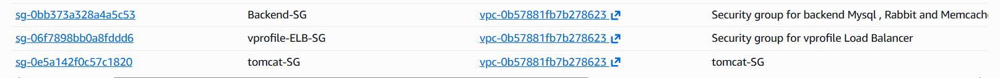
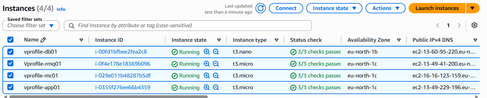

### Load Balancer & HTTPS
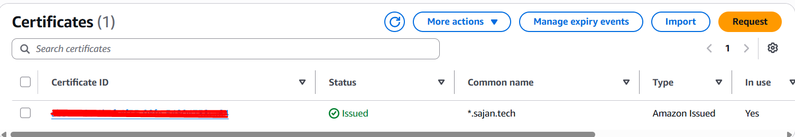
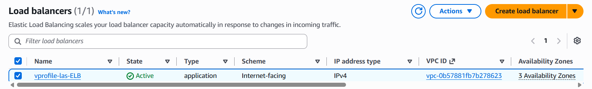
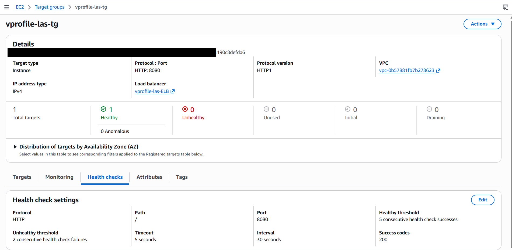

### Application Verification
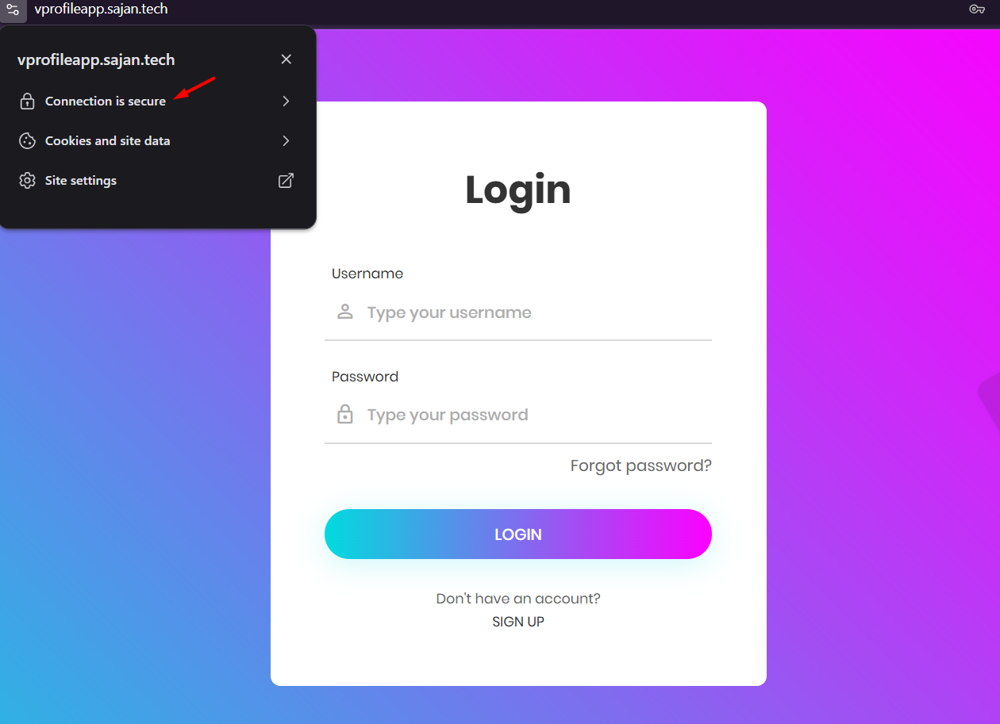
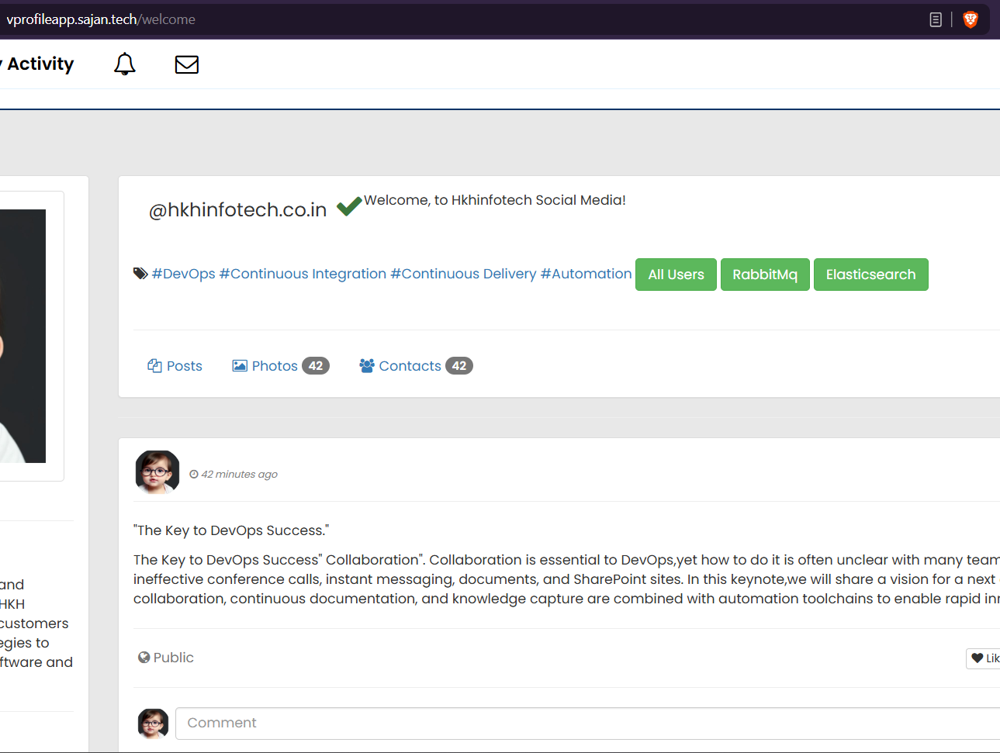
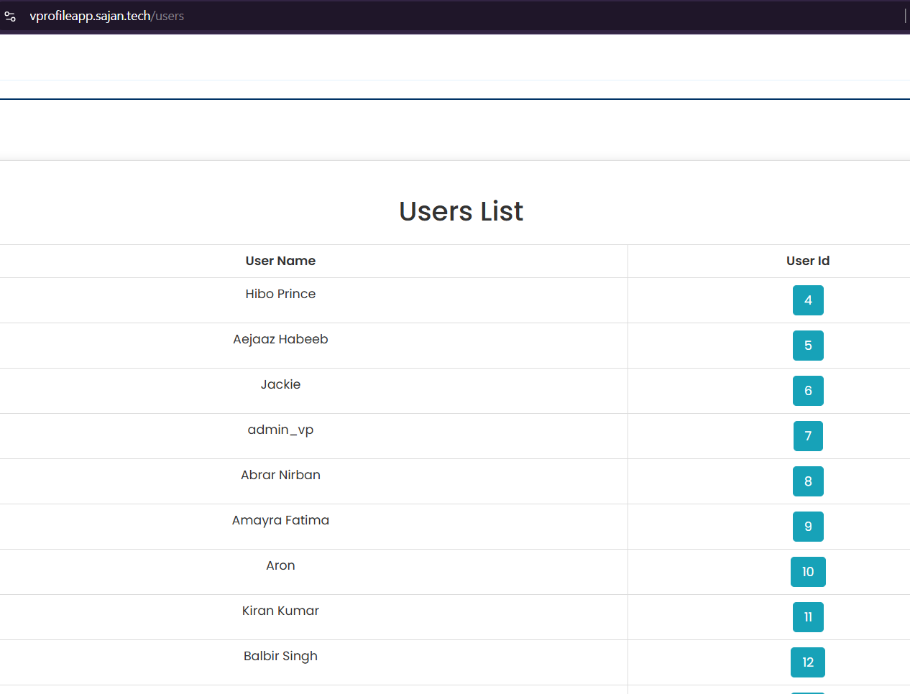
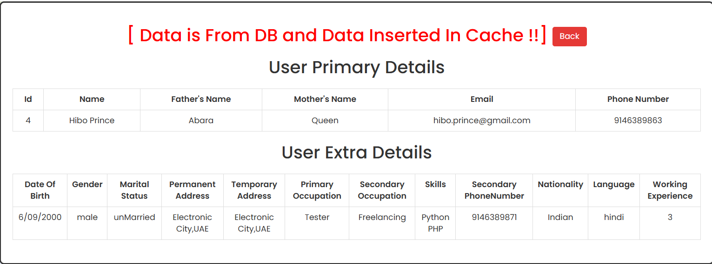
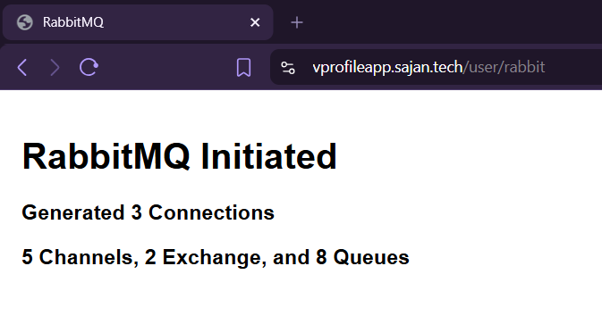

### Auto Scaling Group
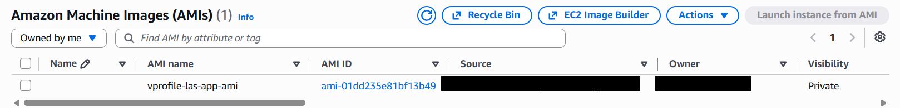
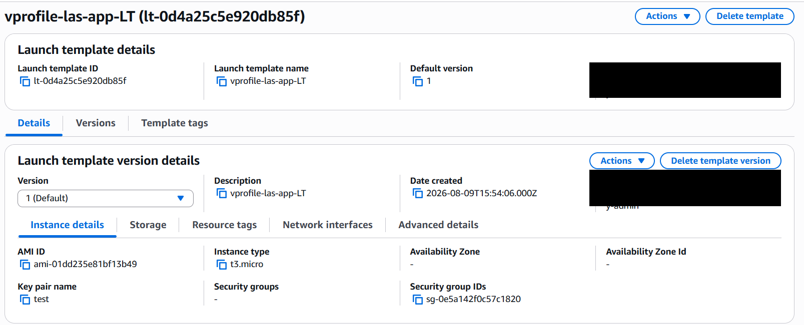
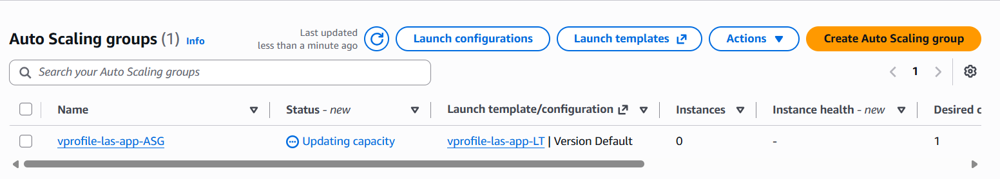
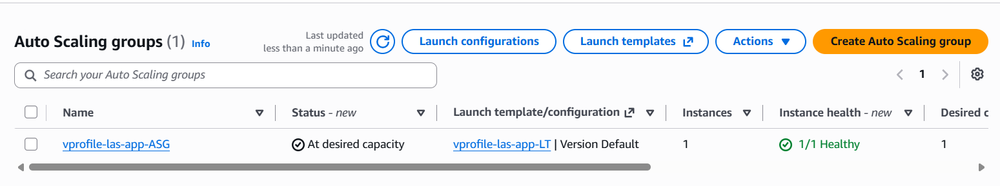
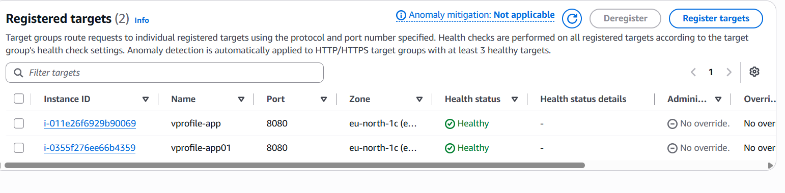
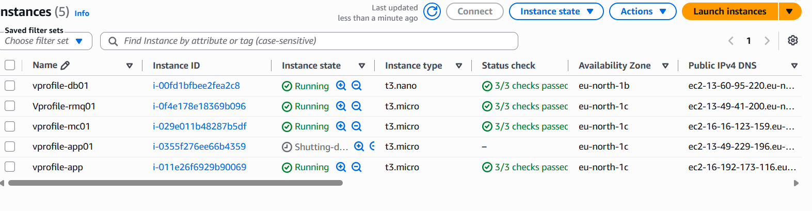

---
*Account IDs and ARNs are cropped from all screenshots above.*
