# Re-Architecture: VProfile on AWS PaaS/SaaS

Refactors the VProfile multi-tier application from self-managed EC2
instances (see [`../lift-and-shift-ec2`](../lift-and-shift-ec2)) onto AWS
managed services — Elastic Beanstalk, RDS, ElastiCache, Amazon MQ, and
CloudFront — trading manual infrastructure management for managed,
auto-scaling, pay-as-you-go platform services.

## Part 2 of a Migration Story

This project is the direct follow-up to `lift-and-shift-ec2`. Together
they demonstrate a realistic migration path:

1. **Lift and shift** — rehost the app on EC2 with minimal changes (fast, low-risk, but still requires managing servers)
2. **Refactor to PaaS/SaaS** *(this project)* — replace self-managed services with their managed AWS equivalents to cut operational overhead and improve scalability

Same application, same architecture shape, fundamentally different
operational model.

## Architecture

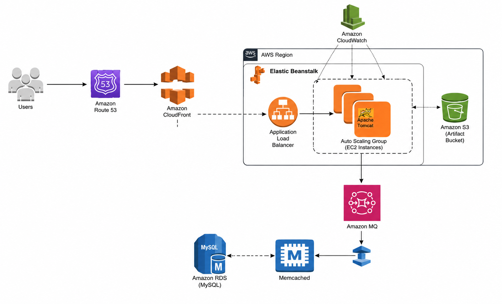

Users reach Route 53, which routes to CloudFront for edge caching and
HTTPS termination. CloudFront forwards to the Elastic Beanstalk
Application Load Balancer, which routes to the Auto Scaling Group of
Tomcat instances (monitored by CloudWatch alarms, artifacts stored in
S3). The app then connects to three managed backend services — Amazon
RDS (MySQL), ElastiCache (Memcached), and Amazon MQ (RabbitMQ).

## Stack

AWS Elastic Beanstalk, Amazon RDS (MySQL), Amazon ElastiCache
(Memcached), Amazon MQ (RabbitMQ), Amazon CloudFront, Route 53, ACM,
IAM, CloudWatch

## Structure

- `src-config/application.properties.example` — sanitized template showing how the app connects to each managed service (RDS/ElastiCache/Amazon MQ endpoints)
- `docs/infrastructure-setup.md` — full reference: IAM role setup, RDS/ElastiCache/Amazon MQ configuration, Beanstalk environment settings, deployment policy comparison, CloudFront setup, and real gotchas hit during setup
- `screenshots/` — deployment evidence

## Key Configuration

- **Elastic Beanstalk** replaces manually-managed EC2 + ASG + ALB — one service bundles compute, scaling, load balancing, artifact storage (S3), and monitoring
- **Custom IAM role** attached to Beanstalk (the auto-generated default role lacks required permissions)
- **RDS, ElastiCache, and Amazon MQ** replace the three backend EC2 instances from the lift-and-shift project — all three sit in one shared backend security group, opened to the Beanstalk instance security group after the environment is created
- **Deployment policy: Rolling, 50% batch** — balances update speed against zero-downtime risk (full comparison of all 5 Beanstalk deployment policies in the docs)
- **Health check path set to `/login`** — required because the app redirects there by default
- **CloudFront** added on top for global edge caching and HTTPS termination, verified via the `Via: cloudfront.net` response header
- **Target group stickiness enabled** — same requirement as the lift-and-shift project, since the app has no shared session state

Full details in [`docs/infrastructure-setup.md`](docs/infrastructure-setup.md).

## How to Run

1. Create the custom IAM role for Beanstalk (4 policies — see docs)
2. Create the shared backend security group (self-referencing rule only, for now)
3. Create the RDS parameter group, subnet group, and MySQL instance
4. Create the ElastiCache parameter group, subnet group, and Memcached cluster
5. Create the Amazon MQ RabbitMQ broker
6. Launch a temporary EC2 instance in the same VPC to initialize the RDS schema, then terminate it
7. Create the Elastic Beanstalk environment (Tomcat platform, custom config, the IAM role from step 1)
8. Add a backend security group rule allowing traffic from the Beanstalk instance security group
9. Collect the RDS/ElastiCache/Amazon MQ endpoints, update `application.properties` (remember: Amazon MQ port is 5671, not 5672), build locally with `mvn install`
10. Upload and deploy the `.war` via the Beanstalk console
11. Add an HTTPS:443 listener to the Beanstalk load balancer using the ACM certificate
12. Create a CloudFront distribution with the Beanstalk ALB as origin, point DNS at CloudFront instead of the ALB directly

## What I changed from the course version

- Used my own fork ([SaajanDevops/vprofile-devops](https://github.com/SaajanDevops/vprofile-devops/tree/awsrefactor)) instead of the instructor's source repo
- [Add anything else you changed — e.g. different domain, adjusted Beanstalk scaling thresholds, different deployment policy, etc.]

## Cleanup Note

Cleanup order matters here. CloudFront must be **disabled** first, then
waited out of "Deploying" state before it can be deleted. The backend
security group's "allow from Beanstalk" rule must be **manually removed
before** terminating the Beanstalk environment, or the rule is left
dangling. After that: RDS → ElastiCache → Amazon MQ → Beanstalk
environment → CloudFront → DNS records → security groups.

## Screenshots

### Backend Services (Managed)
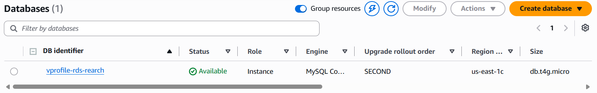
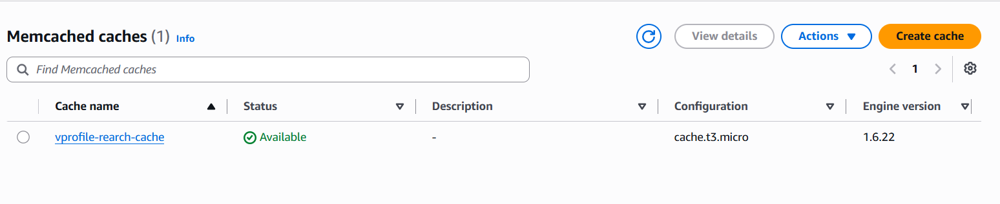
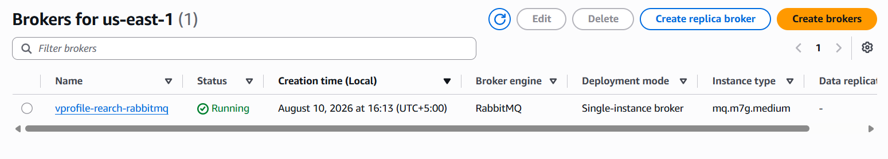

### Elastic Beanstalk Environment
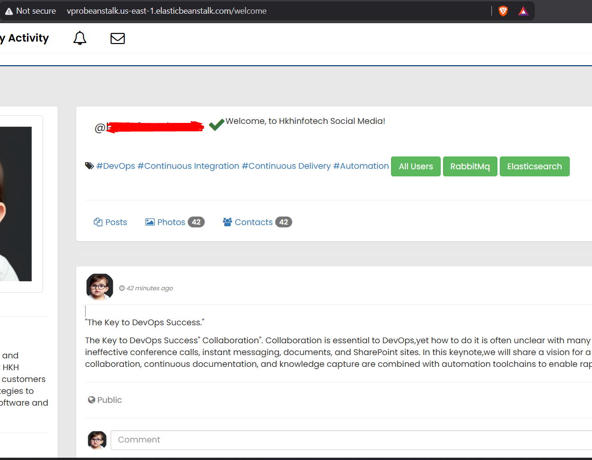
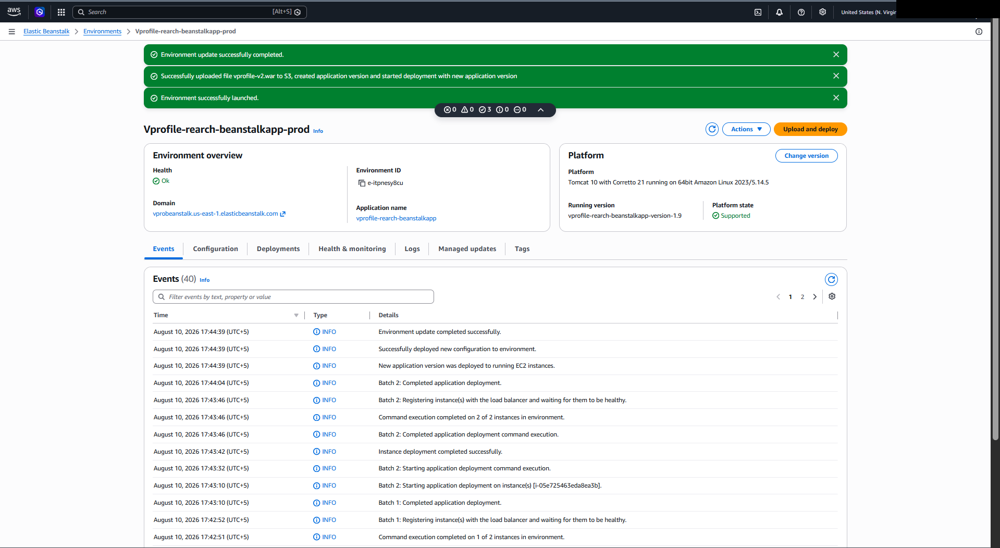
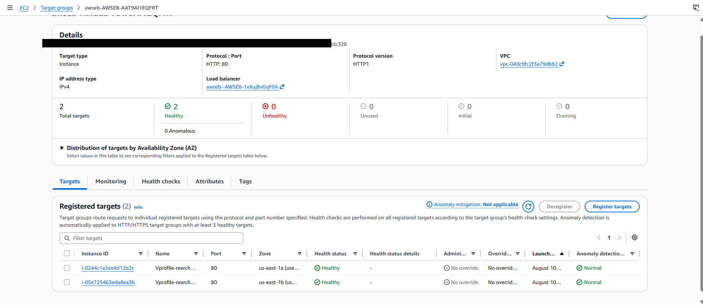
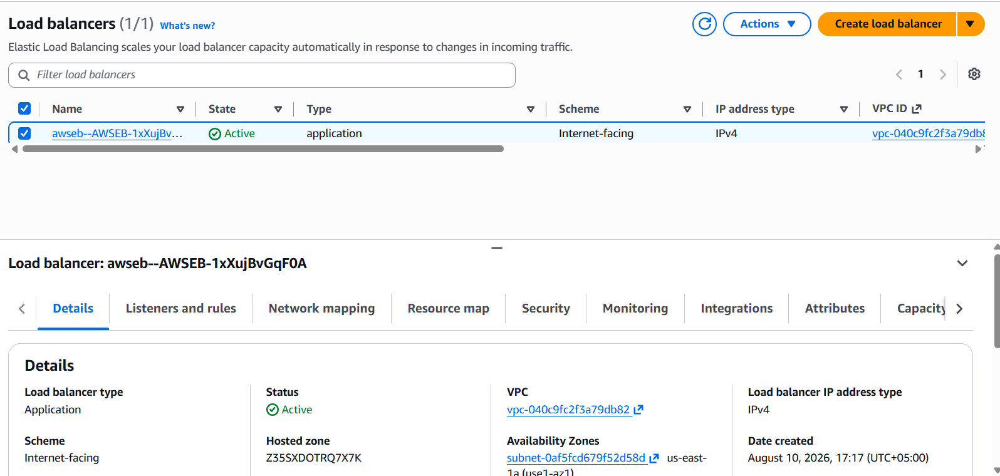
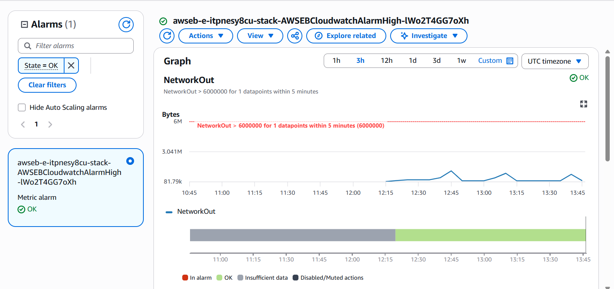

### CloudFront & HTTPS
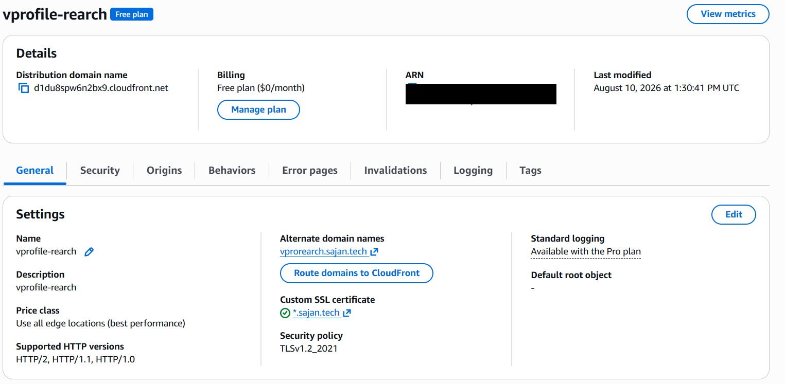
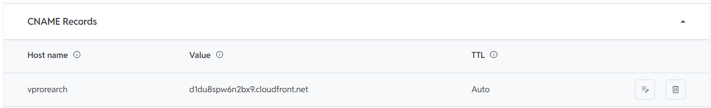
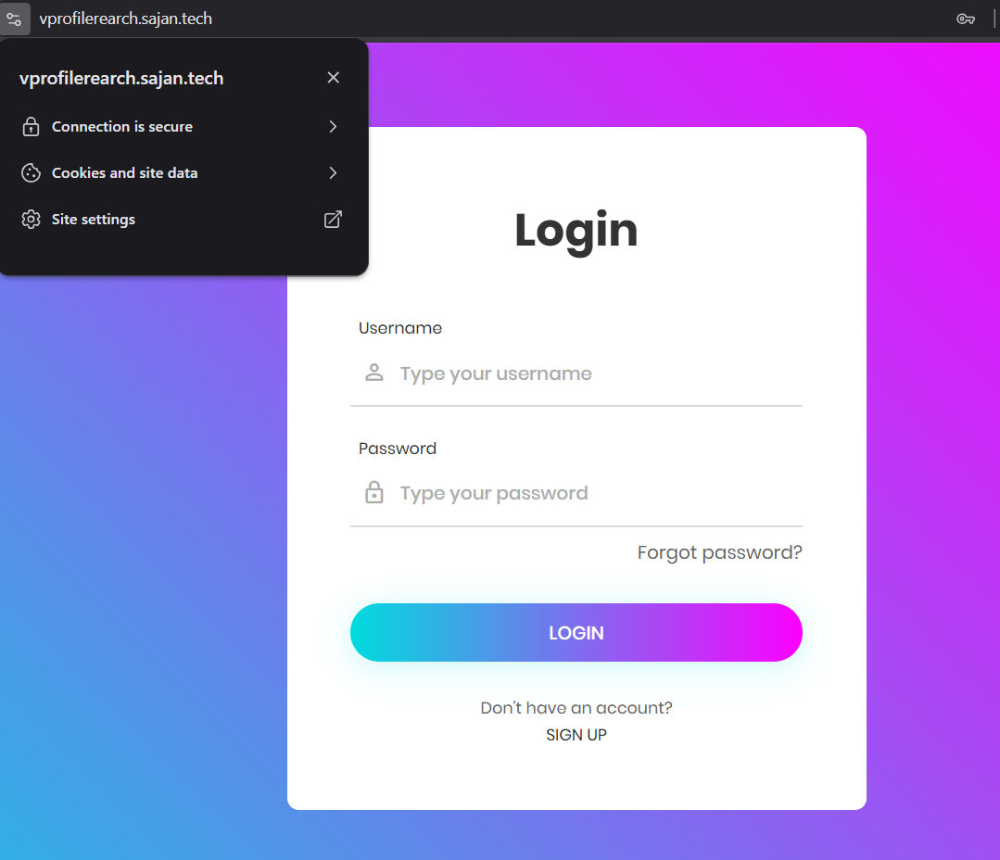

### Application Verification
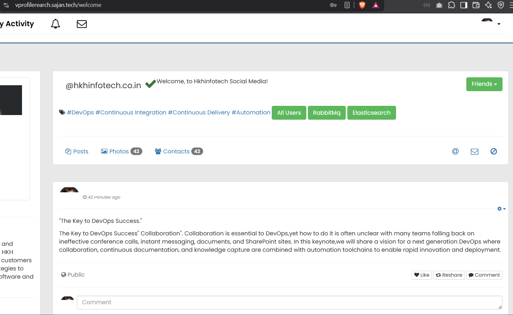
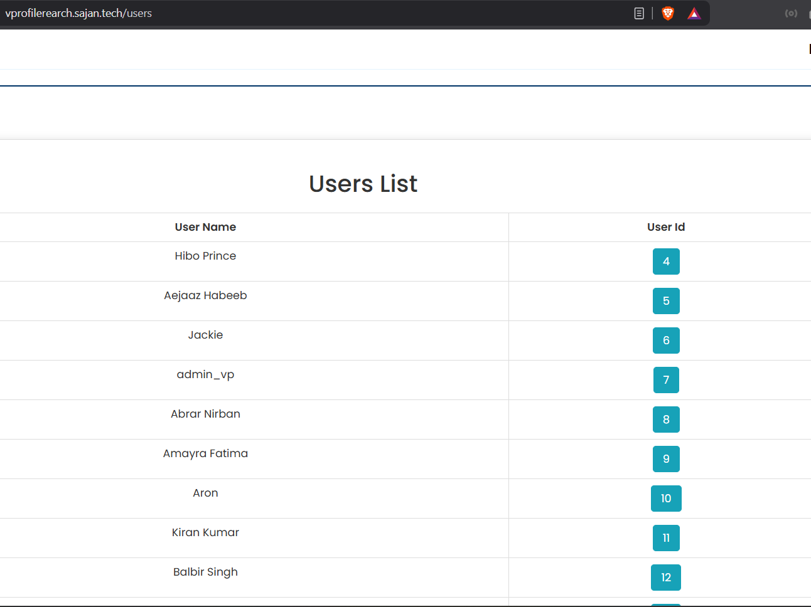
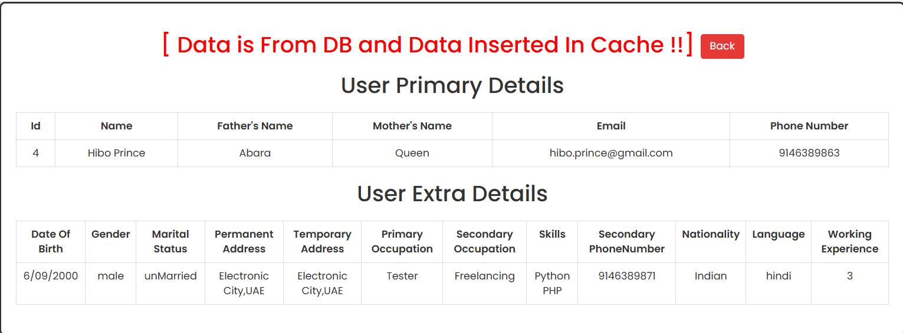
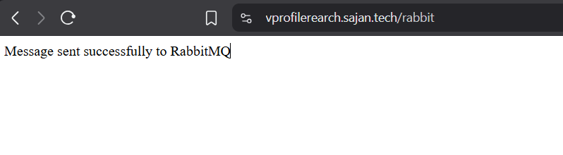

---
*Account IDs and ARNs are cropped from all screenshots above. The
architecture diagram is a reference diagram used while learning this
pattern; redrawing an original version is on the list of future
improvements for this project.*
