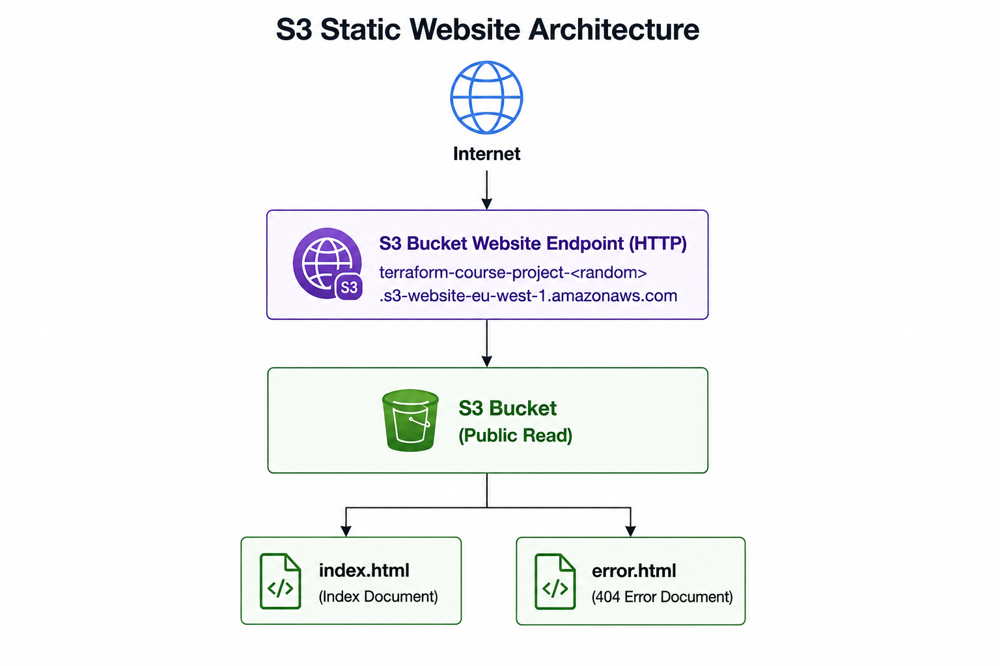
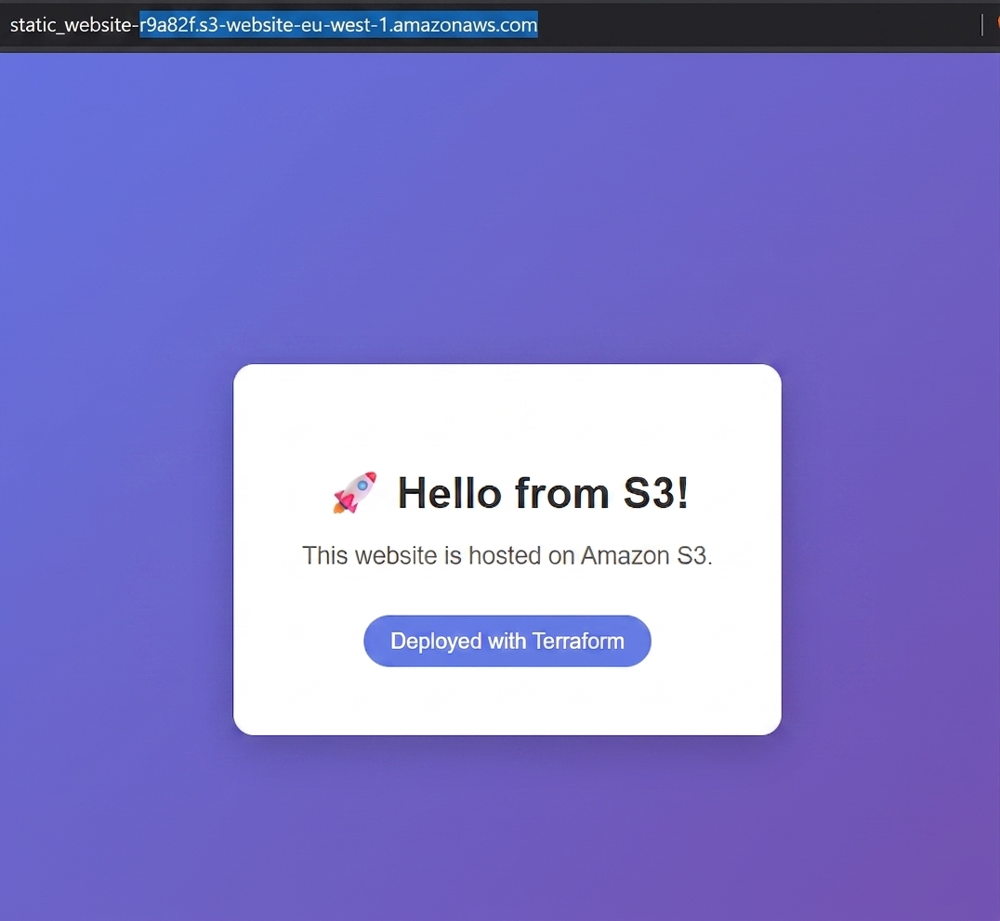
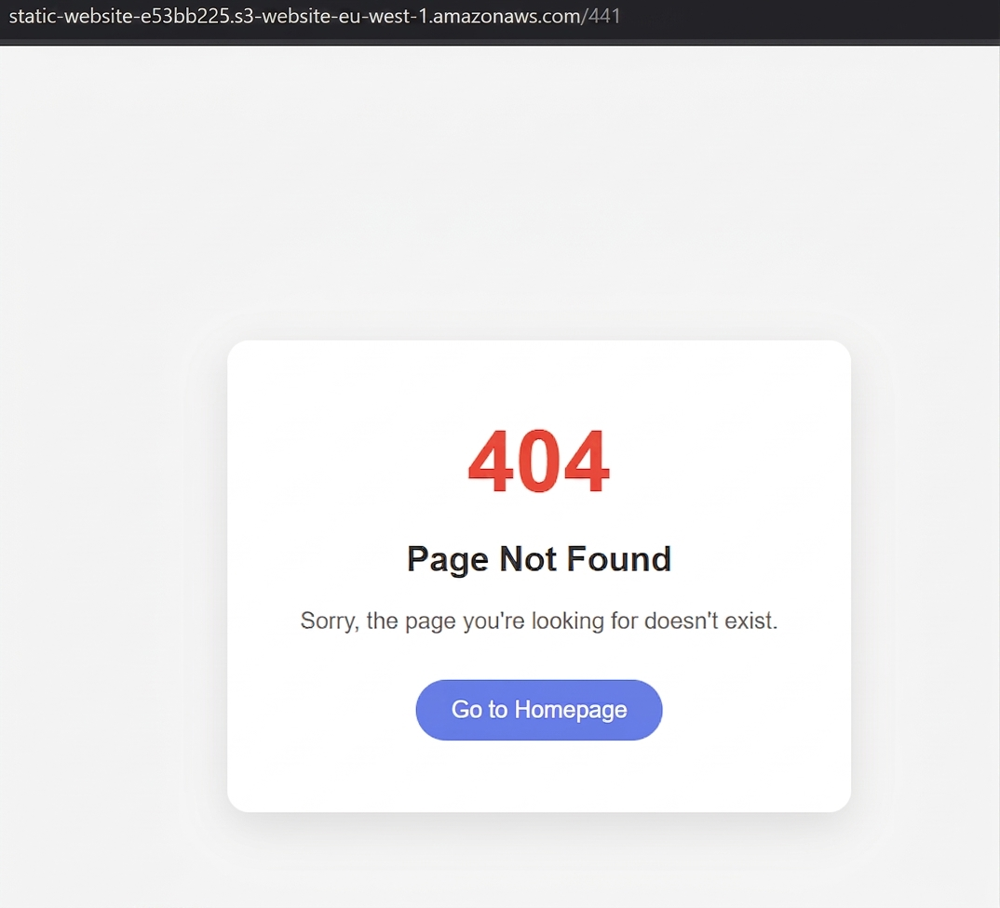

# Terraform S3 Static Website

Deploys a static website directly to Amazon S3 using S3's built-in
website hosting feature — no EC2 instance, no web server to manage.
Terraform provisions the bucket, configures it for public web hosting,
and uploads the site files in one apply.

## Architecture

```
                    Internet
                        │
                        ▼
        S3 bucket website endpoint (HTTP)
   terraform-course-project-<random>.s3-website-eu-west-1.amazonaws.com
                        │
                        ▼
              S3 bucket (public read)
      ┌─────────────────┴─────────────────┐
      ▼                                    ▼
 index.html                          error.html
 (index document)                    (404 error document)
```

## Stack

Terraform (~> 1.7), AWS Provider (~> 5.0), Random Provider (~> 3.0),
Amazon S3 (static website hosting)

## Structure

- `provider.tf` — Terraform and provider version constraints (AWS + Random), region config
- `s3.tf` — the bucket, its public access configuration, bucket policy, website configuration, and the two uploaded objects
- `outputs.tf` — outputs the S3 website endpoint after apply
- `build/index.html` — the site's homepage
- `build/error.html` — the custom 404 page
- `.gitignore` — excludes `.terraform/`, state files, and other local-only Terraform artifacts from the repo

## Key Concepts Demonstrated

- **`random_id` for globally unique naming** — S3 bucket names must be unique across _all_ of AWS, not just your account, so a random 4-byte hex suffix is appended to the bucket name to avoid collisions on every apply
- **Public access block overridden deliberately** — S3 buckets block public access by default (a safety default); all four `block_*`/`ignore_*`/`restrict_*` settings are explicitly set to `false` here because a public static website genuinely needs public read access. This is a case where turning _off_ a security default is the correct, intentional choice — not an oversight
- **Bucket policy for public read** — a minimal IAM policy granting `s3:GetObject` to everyone (`Principal = "*"`), scoped only to objects inside this bucket (`Resource = "${bucket.arn}/*"`), not the bucket itself — the policy can't be used to list or modify the bucket, only read individual objects
- **Website configuration with index/error documents** — `aws_s3_bucket_website_configuration` is what actually turns the bucket into a web server: `index.html` serves as the default document, `error.html` serves as the 404 fallback
- **Content-aware uploads with change detection** — each `aws_s3_object` sets `etag = filemd5(...)`, so Terraform detects when a local HTML file's contents change and re-uploads only when the file actually differs, rather than uploading unconditionally on every apply
- **`content_type` set explicitly** — without this, S3 would serve the HTML files with a generic binary content type instead of `text/html`, and browsers would prompt a download instead of rendering the page

## How to Run

```bash
terraform init
terraform plan
terraform apply
```

After apply, get the live site URL from the output:

```bash
terraform output static_website_endpoint
```

Open that URL in a browser — it should load `index.html`. Visiting any
non-existent path on that domain should return the custom `error.html`
page instead of S3's default XML error response.

```bash
terraform destroy
```

## What I changed from the course version

[Add your own modification here — e.g. customized the HTML content, different region, added a CloudFront distribution in front of the bucket for HTTPS, etc.]

## A Note on State Files

This project's local folder also contains `.terraform/`, `terraform.tfstate`,
and `terraform.tfstate.backup` — none of these are included here, and
none should be committed to a public repo (see `.gitignore`). State
files describe the exact resources Terraform deployed for _you_
specifically; they're not portable, aren't useful to someone reading
your portfolio, and can leak resource metadata. If your local repo
already has these tracked in git history, remove them with
`git rm --cached -r .terraform terraform.tfstate*` before pushing.

## Screenshot

### Architecture



### Deployment Result

#### Website Homepage



#### Error Page


