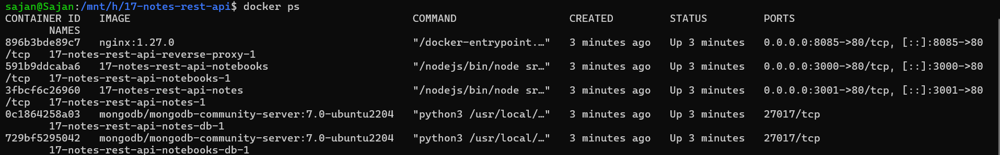
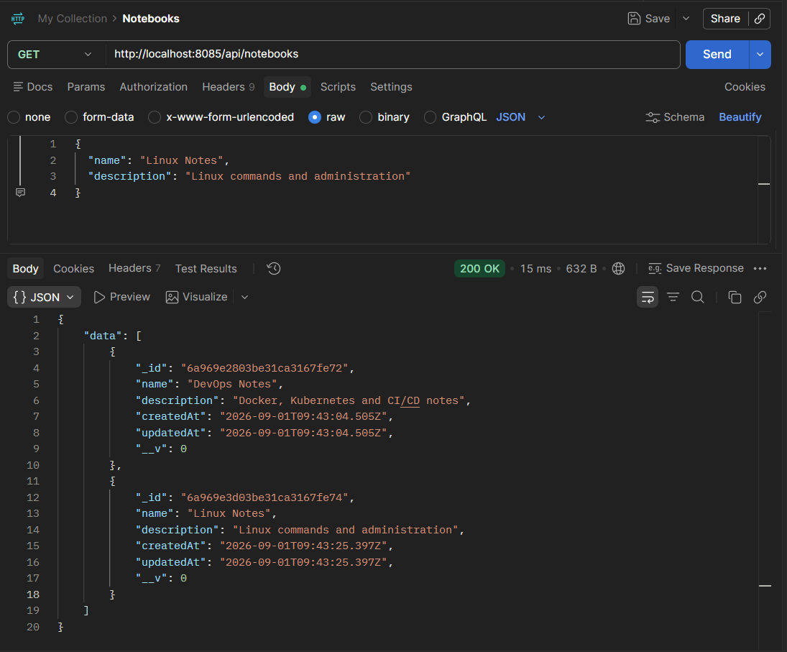
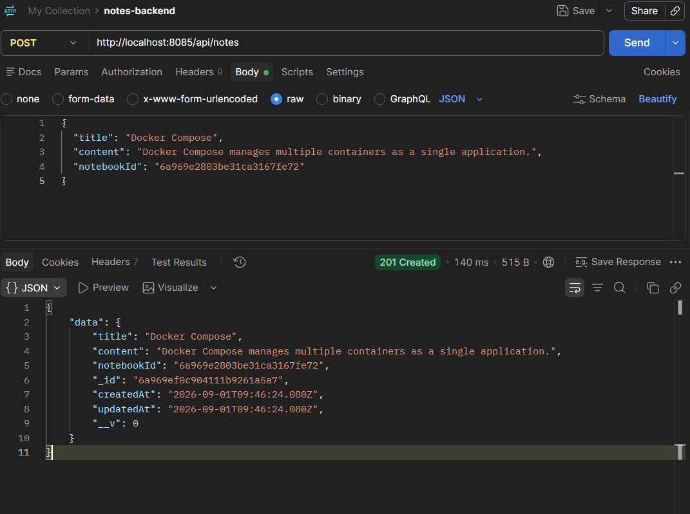
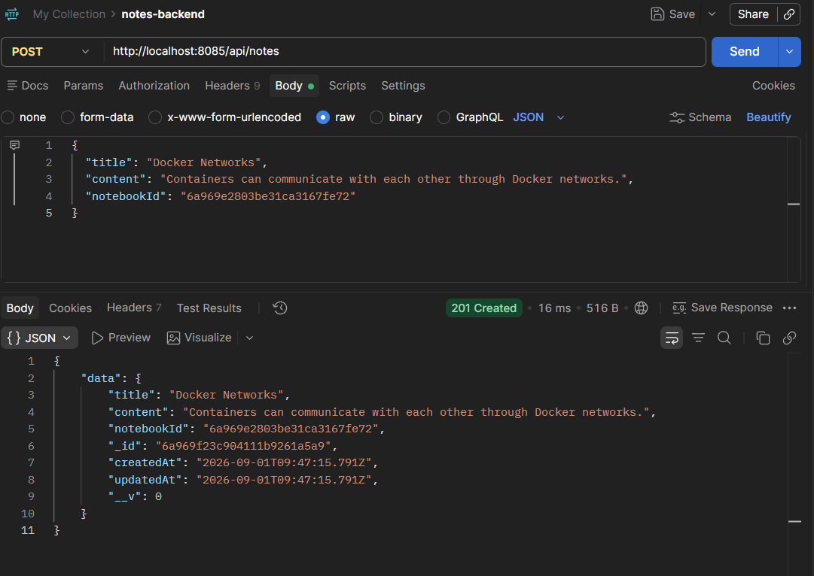
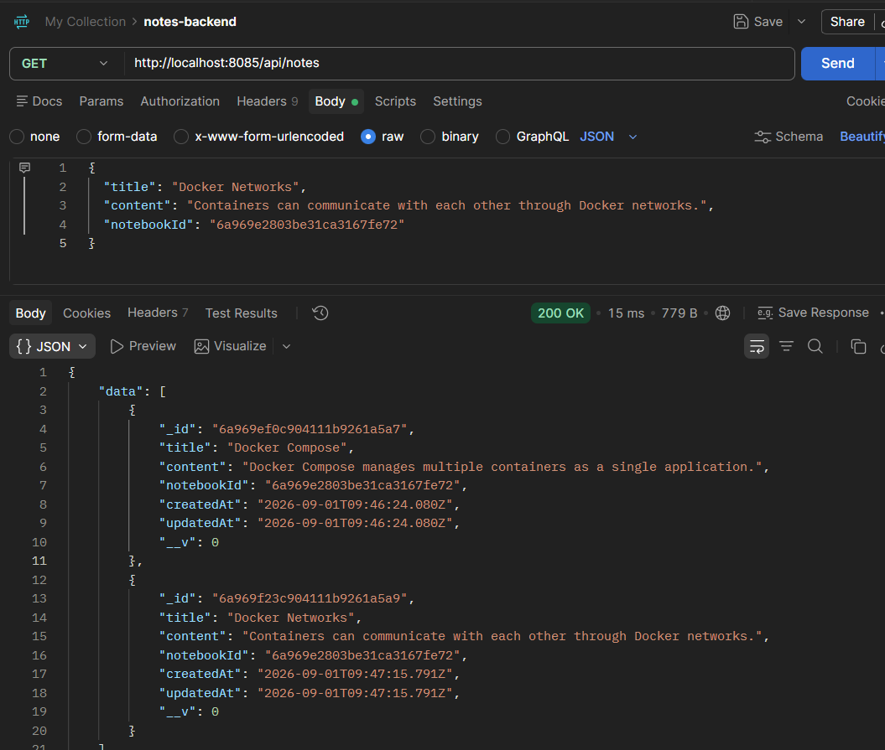

# Notes REST API — Multi-Service Docker Compose

A microservices-style Notes application: two independent Node.js/Express
REST APIs (**notebooks** and **notes**), each with its own MongoDB
database, sitting behind a single NGINX reverse proxy that routes
requests by URL path. Demonstrates multi-project Docker Compose
orchestration, multi-stage builds with distroless production images,
and resilient inter-service communication.

## Architecture

```
                          Client
                            │
                            ▼
                  NGINX reverse proxy (:8085)
                    ┌───────┴───────┐
          /api/notebooks       /api/notes
                    │               │
                    ▼               ▼
            notebooks service   notes service
             (Express, :80)     (Express, :80)
                    │               │  │
                    ▼               ▼  └──(sync HTTP call)──► notebooks service
             notebooks-db        notes-db                     (validates notebookId)
              (MongoDB)          (MongoDB)
```

Two independent Compose projects (`notebooks-backend/`, `notes-backend/`)
are combined into one at the root via Compose's `include`, then extended
with a `compose.override.yaml` that connects both API services to a
shared network so the reverse proxy — and the services themselves — can
reach each other by service name.

## Stack

Docker, Docker Compose (`include` + `override` merging, `develop.watch`
hot reload), Node.js 22, Express, Mongoose, MongoDB, NGINX (reverse
proxy), Axios, Distroless production images

## Structure

- `compose.yaml` — root compose file: includes both backend projects, defines the reverse proxy service and the shared network
- `compose.override.yaml` — connects `notebooks` and `notes` services to the shared `notes-app-net` network (Compose loads this automatically alongside `compose.yaml`)
- `reverse-proxy/nginx.conf` — routes `/api/notebooks` and `/api/notes` to their respective upstream services by name
- `notebooks-backend/` — standalone Compose project: Express API + MongoDB, runnable entirely on its own
- `notes-backend/` — standalone Compose project: Express API + MongoDB, runnable entirely on its own, plus the inter-service validation call to `notebooks-backend`
- Each backend has:
  - `Dockerfile` — multi-stage: `development` (nodemon, hot reload) → `prod-dependencies` (production-only npm install) → final distroless production stage
  - `compose.yaml` — service definition, database, volumes, networks
  - `db-config/mongo-init.js` — creates the service-specific DB user on first container startup
  - `src/server.js`, `src/models.js`, `src/routes.js` — the Express application
  - `.env.example` — template for local MongoDB credentials (copy to `.env`, which is gitignored)

## API Reference

**Notebooks** (`/api/notebooks`)
| Method | Path | Body | Notes |
|---|---|---|---|
| POST | `/` | `{ name, description? }` | `name` required → 400 if missing; returns 201 |
| GET | `/` | — | Returns all notebooks |
| GET | `/:id` | — | 404 if not found or invalid ObjectId |
| PUT | `/:id` | `{ name, description }` | 404 if not found |
| DELETE | `/:id` | — | 204 on success, 404 if not found |

**Notes** (`/api/notes`)
| Method | Path | Body | Notes |
|---|---|---|---|
| POST | `/` | `{ title, content, notebookId? }` | `title`+`content` required → 400; optional `notebookId` is validated against the notebooks service (see below) |
| GET | `/` | — | Returns all notes |
| GET | `/:id` | — | 404 if not found or invalid ObjectId |
| PUT | `/:id` | `{ title, content }` | 404 if not found |
| DELETE | `/:id` | — | 204 on success, 404 if not found |

## Key Concepts Demonstrated

- **Compose project merging with `include`** — the root `compose.yaml` pulls in two fully independent Compose projects (each with their own services, networks, and volumes) and layers a reverse proxy on top, without modifying either project's own files
- **`compose.override.yaml` for cross-project networking** — rather than editing `notebooks-backend/compose.yaml` and `notes-backend/compose.yaml` directly to add a network only needed at the combined-project level, the override file adds it non-invasively. Each backend still works perfectly standalone (`cd notebooks-backend && docker compose up`) without ever needing this network
- **Network isolation by design** — the reverse proxy can reach `notebooks` and `notes` (both on `notes-app-net`), but _cannot_ reach `notebooks-db` or `notes-db` directly, since those only sit on their own backend-specific networks. This is intentional defense in depth, not an oversight
- **Multi-stage Dockerfile with a distroless production target** — one Dockerfile serves both environments: `development` installs all dependencies and runs via `nodemon` for hot reload; `production` copies only production `node_modules` into a `gcr.io/distroless/nodejs22` base image, which has no shell, no package manager, and no unnecessary binaries — a meaningfully smaller attack surface than a full Node image
- **Resilient inter-service communication** — when creating a note with a `notebookId`, the notes service makes a synchronous HTTP call to the notebooks service to validate the ID exists. If the notebooks service returns a 404, the note is rejected with 400. If the notebooks service is _unreachable entirely_ (down, timing out), the note is still saved with the provided ID rather than failing outright — a deliberate trade-off favoring availability over strict consistency, with the inconsistency logged for later reconciliation rather than silently ignored
- **Per-service database users via `mongo-init.js`** — each MongoDB container creates its own scoped database user (`readWrite` on its own DB only) on first boot via a bind-mounted init script, rather than every service sharing the root MongoDB credentials

## How to Run

Run the whole system together from the root:

```bash
docker compose up --build --watch
```

Or run either backend completely standalone:

```bash
cd notebooks-backend
docker compose up --build --watch
```

By default, the compose files don't set a build `target`, so Compose
builds the **last stage** of the multi-stage Dockerfile — the distroless
production image. See the gotcha below before expecting hot reload to
work out of the box.

Once running, hit the reverse proxy directly:

```bash
curl http://localhost:8085/api/notebooks
curl http://localhost:8085/api/notes
```

Stop everything:

```bash
docker compose down
```

## Known Gotchas

- **Default build target is production, not development** — since neither `compose.yaml` specifies `target:`, `docker compose up --build --watch` builds the distroless production stage by default. That image has no shell (`sh: not found`), so Compose's file-sync watch mechanism fails, and there's no `nodemon` process to reload anyway. To get hot reload working, add `target: development` under each service's `build:` section.
- **`notes-backend/Dockerfile.dev` is a leftover** — an earlier, single-stage version of the Dockerfile that predates the multi-stage refactor. It's unused by any compose file now that both stages live in the main `Dockerfile`; safe to delete.
- **Root-level `package.json` (with only `axios` listed) is orphaned** — nothing in either compose project installs from or references it; the actual `axios` dependency each service needs is already declared in `notes-backend/package.json`. Likely leftover from an early experiment before Axios was added directly to the `notes-backend` service.
- **The Docker VS Code extension may show a schema warning on `include:`** — this is a known extension bug, not an invalid Compose file; the long-form `- path: ...` syntax used here is valid and works correctly.
- **Reverse proxy config uses plain HTTP `proxy_pass`** — no HTTPS/TLS is configured here, appropriate for local development only.

## Screenshots

### 01 — All five containers running

`docker ps` showing the reverse proxy, both APIs, and both MongoDB containers running together.



### 02 — GET notebooks through NGINX

Successful `GET /api/notebooks` request through the NGINX reverse proxy, returning the created notebooks.



### 03 — POST Docker Compose note

Successful `POST /api/notes` request creating a note associated with a notebook.



### 04 — POST Docker Networks note

Successful `POST /api/notes` request creating a second note associated with a notebook.



### 05 — GET notes through NGINX

Successful `GET /api/notes` request through the NGINX reverse proxy, returning the created notes.


