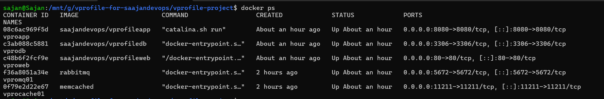
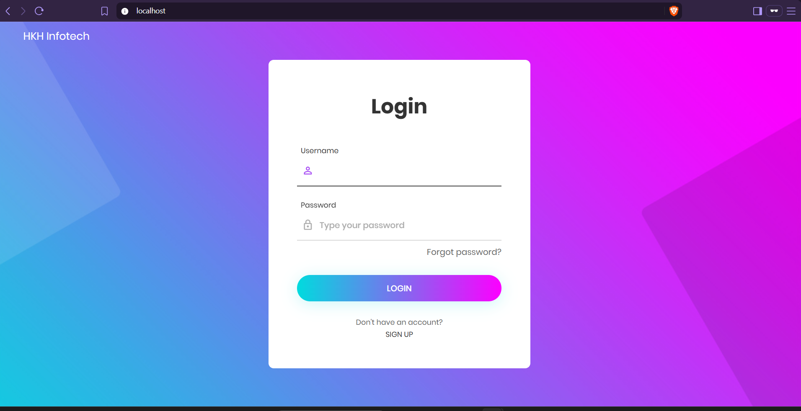
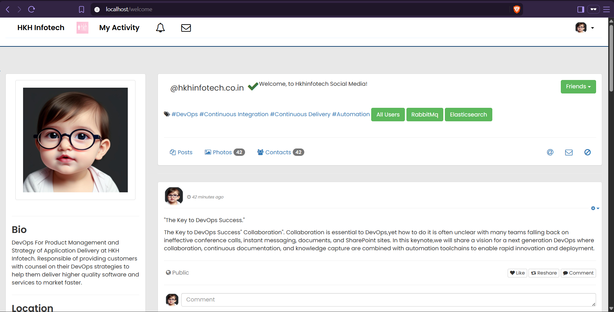
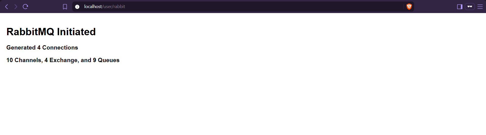
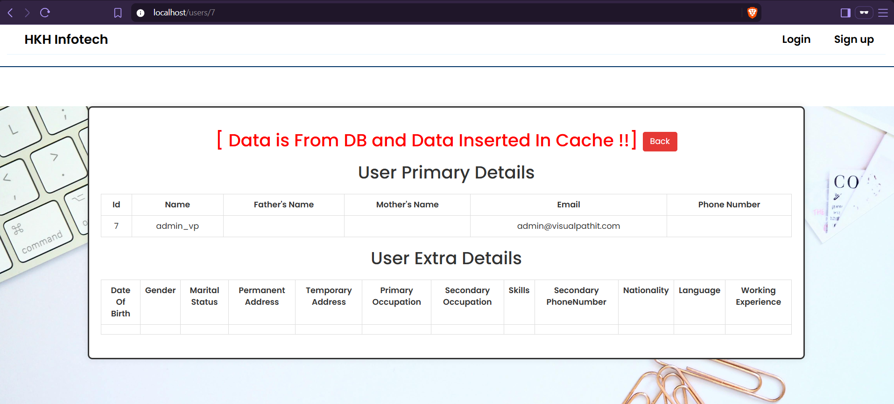

# VProfile — Containerized with Docker & Docker Compose

Containerizes the VProfile multi-tier Java app (previously deployed on
EC2/Beanstalk in earlier projects) into 5 Docker containers, orchestrated
with a single `compose.yaml`, images pushed to Docker Hub. Run locally
with Docker Desktop — no VM required.

## Architecture

```
Browser → nginx (vproweb:80) → Tomcat (vproapp:8080) → MySQL (vprodb:3306)
                                                        → Memcached (vprocache01:11211)
                                                        → RabbitMQ (vpromq01:5672)
```

## Stack

Docker, Docker Compose, Docker Hub, Maven (multi-stage build), Tomcat 10 / JDK 21, MySQL 8.0, NGINX, Memcached, RabbitMQ

## Structure

- `compose.yaml` — defines and links all 5 services
- `Docker-files/app/Dockerfile` — multi-stage: Maven builds the `.war` from source, then copies it into a clean Tomcat image (keeps the final image free of build tools)
- `Docker-files/db/Dockerfile` — MySQL image pre-loaded with schema (`db_backup.sql` auto-runs via MySQL's `docker-entrypoint-initdb.d` convention)
- `Docker-files/web/Dockerfile` — NGINX reverse proxy, config swapped for one that forwards to the `vproapp` container by name
- `vprocache01` (Memcached) and `vpromq01` (RabbitMQ) — official images used as-is, no customization needed

## How to Run

```bash
docker compose up --build -d
docker compose ps
```

Visit `http://localhost` — login `admin_vp` / `admin_vp`. Check RabbitMQ
and Memcached via the app's own test pages (linked from the homepage).

```bash
docker compose down -v
```

## What I changed from the course version

- Ran directly on **Docker Desktop** rather than provisioning a Vagrant VM with Docker Engine first — same containers and compose file, one less layer to manage locally
- [Add anything else you changed]

## Screenshots

### Docker Compose Services



### Vprofile Login Page



### Logged in Homepage



### RabbiqMQ



### Memcache


